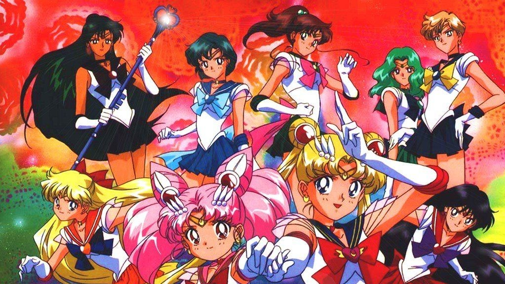
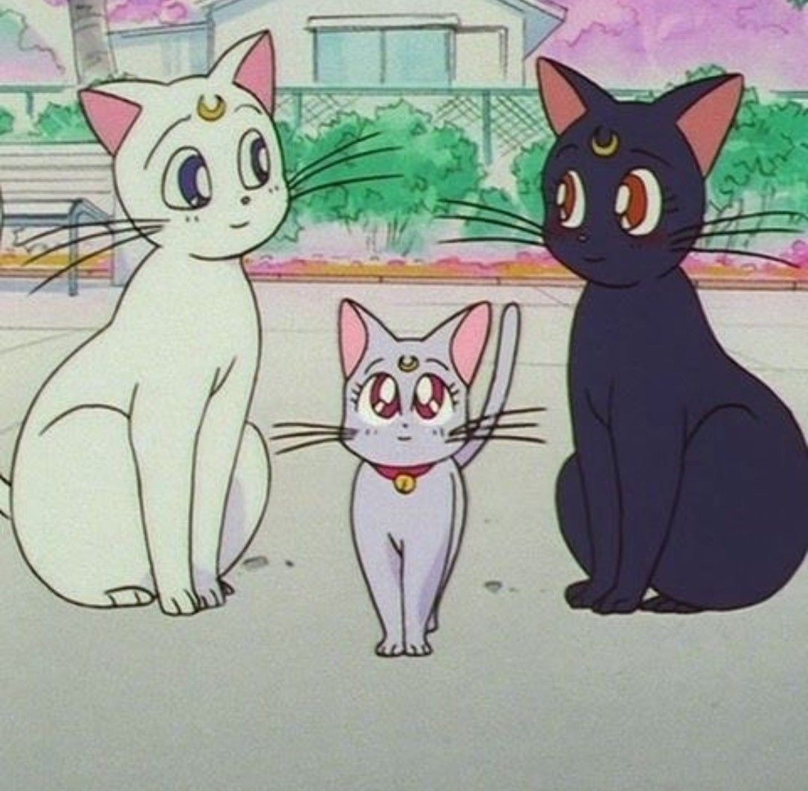
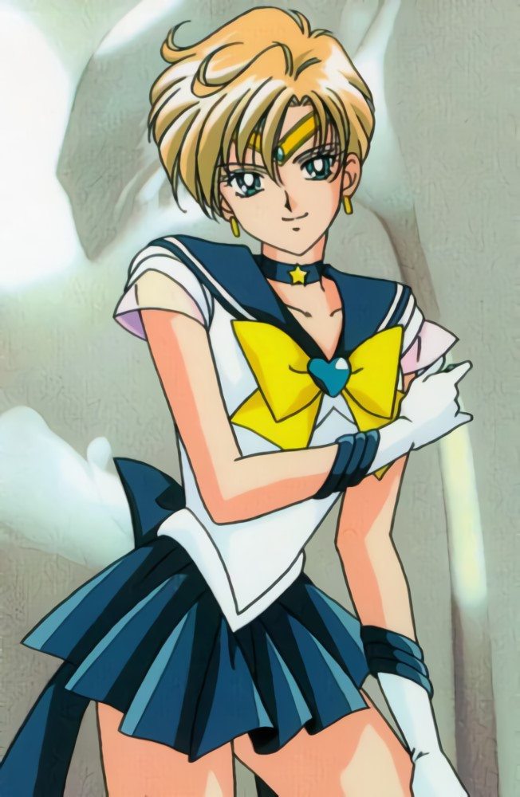
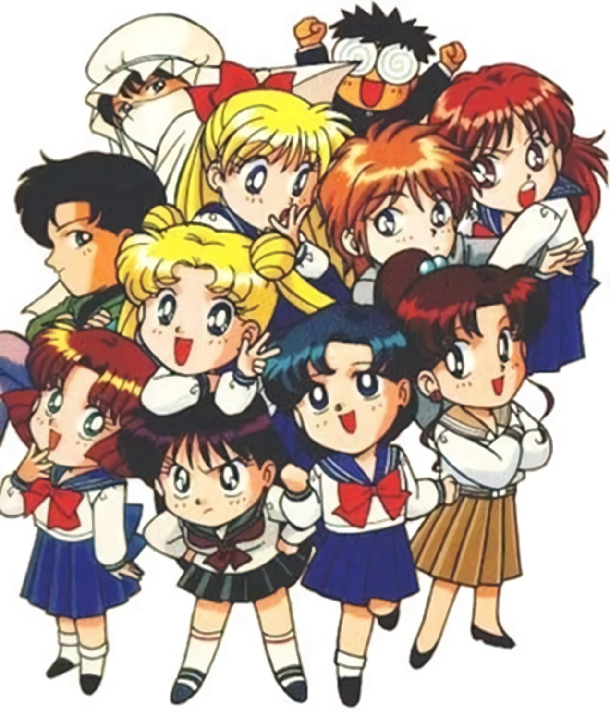
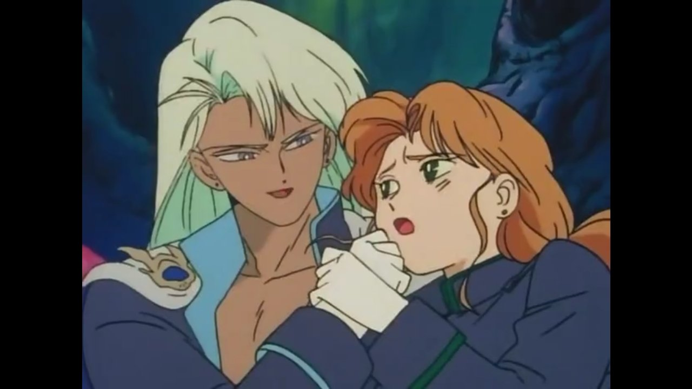
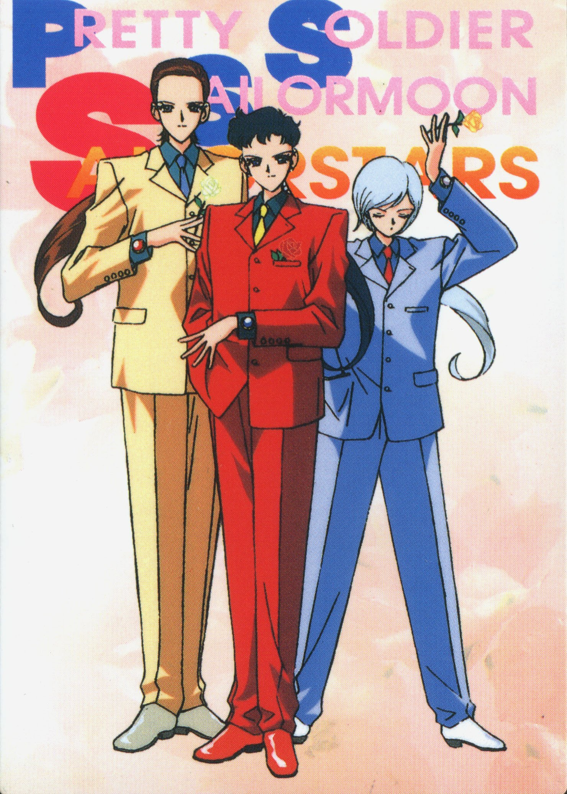
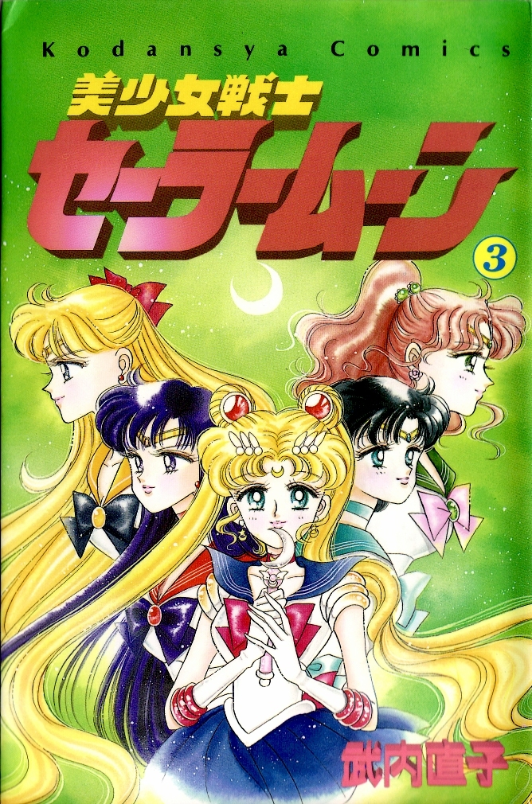
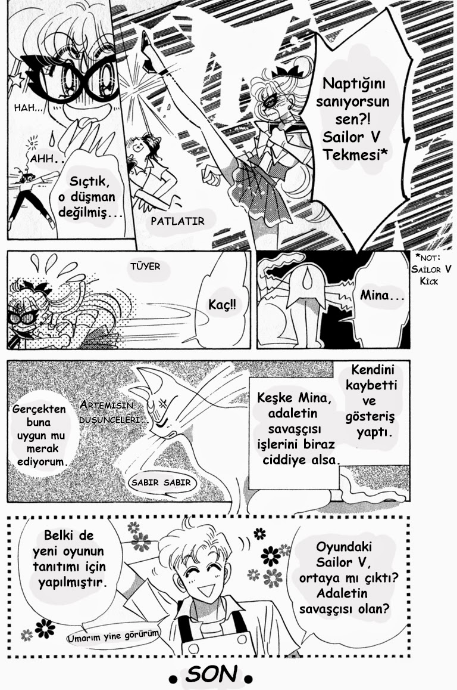
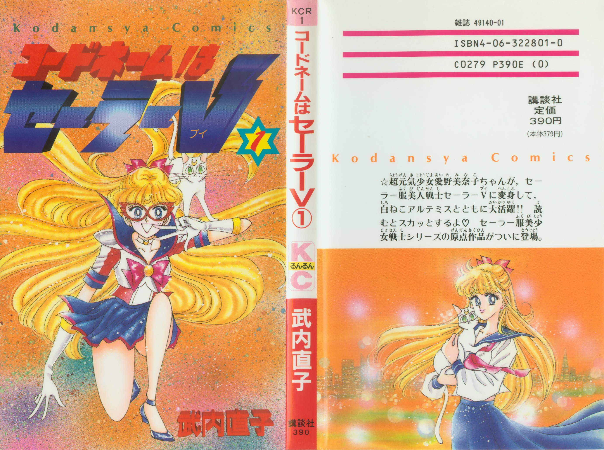
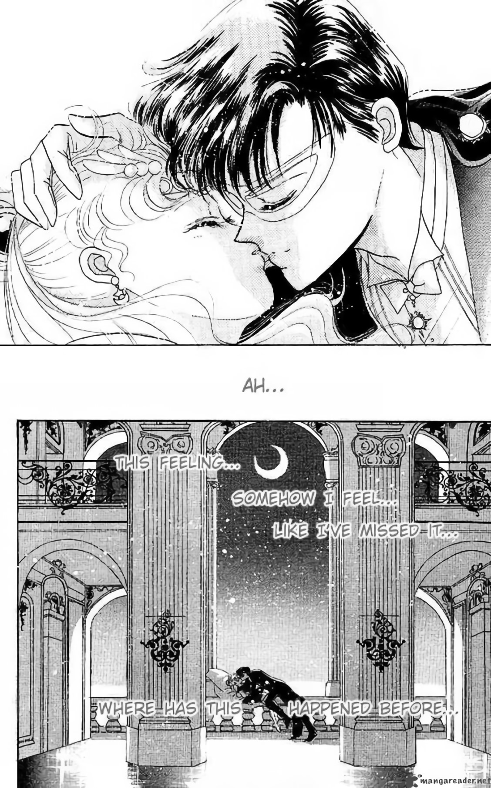

# Sailor Moon: Minifaldas, aventura, comedia y la vida en los noventas

**Por Leandro Oberto**

> Y pasó nomas… Luna y Artemis tuvieron una gatita!

El 7 de marzo de 1992, las pantallas de televisión japonesas fueron sacudidas con la llegada de una serie que se convertiría en un fenómeno social a nivel nacional y mas tarde planetario: Bishojo Senshi Sailor Moon (preciosa guerrera Sailor Moon). Un innovativo dibujo animado basado en un exitoso cómic publicado en la revista Nakayoshi, una de las mas populares revistas de comics orientadas al publico femenino de la editorial Kodansha. Gracias a ella su autora, una joven de nombre Naoko Takeuchi, pronto vio su popularidad disparada elevándola al super estrellato. Permitiéndole hoy alternar picadas en su Ferrari con el dibujo y guión del manga.

> Sailor Venus pone cara de "yo no me la como"

En Argentina la serie (que ya era muy popular entre los fanáticos de la animación japonesa, y un nombre bastante conocido en los negocios de comics) salto al publico masivo en abril de 1996, cuando sus primeros 46 capítulos comenzaron a ser emitidos en televisión. ¡Iniciando un furor que al día de hoy no ha parado de crecer!. No se trata de un furor cualquiera, dado que ha logrado llevar finalmente a chicas y mujeres a entrenar gustosamente en los negocios de comics. Recordemos que aunque en Japón las mujeres son como lectoras y creadoras ligeramente mas del cincuenta por ciento del total, en la mayor parte de occidente, por ahora son en promedio una minoría que apenas alcanza al diez por ciento. ¡Aunque esperemos que no por mucho!

En esta primer nota haremos un repaso a las series de televisión que componen esta saga: Sailor Moon, Sailor Moon R, Sailor Moon S, Sailor Moon Super S y Sailor Stars.

Muchos nombres de los protagonistas fueron modificados al realizarse el doblaje al castellano.

> Sailor Uranus… Tan linda… y es tortillera! mundo ingrato!

## Aqui algunas equivalencias

| español | japones |
| --- | --- |
|Serena Tsukino | Usagi Tsukino |
|Rei Hino | Rei Hino| 
|Lita Kino | Makoto Kino| 
|Ami Mizuno | Ami Mizuno| 
|Mina Aino | Minako Aino| 
|Darien | Mamoru Chiba| 
|Tuxedo Mask | Tuxedo Kamen| 
|Molly | Naru| 
|Milenio de plata | Silver Millenium| 
|Negafuerza | Reina Metalia |
|Malachite | Kunshaite |
|Luna | Luna |
|Sammy Tsukino | Shingo Tsukino |
|Kelvin | Uminio |
|Rini | Chibiusa |

## Sailor Moon: Las Series de TV

### SAILOR MOON  

#### Capitulos 1-46 Toei Animation 

> Emitida en Japon entre marzo de 1992 y febrero de 1993.

Esta serie nos cuenta el origen de las Sailor Scouts de nuestra era y su lucha contra el Dark Kingdom. Conocemos a Usagi, Ami, Rei, Minako, Makoto, Luna, Artemis y Tuxedo Kamen, quienes poco a poco, durante su guerra contra el renacido Dark Kingdom de Metalia, van descubriendo su olvidado pasado.

> Toda la banda de Sailor Moon en version super-deformed

## SAILOR MOON R.  

### Capítulos 47-89 

> Emitida en Japón entre marzo de 1993 y marzo de 1994

> Zoycite era un hombre! Que pareja de comilones!!!

Esta serie esta dividida en dos sagas. La primera es una lucha contra dos aliens que quieren absorber la energía de los humanos para alimentar un árbol cósmico, razón por la cual luna y Artemis debe devolverle sus poderes y recuerdos a las Scouts. Y una segunda que trae la llegada de Chibiusa, una niña proveniente del futuro que es la hija de Tuxedo y Usagi. Viajes temporales y la aparición de Sailor Pluto completan esta historia. Finaliza en el capítulo 88, el 89 es un resumen de la serie.

## SAILOR MOON S  

### Capítulos 90-127 

> Emitida en Japón desde marzo de 1994

Dos nuevas Sailors se suman: Sailor Neptune y Sailor Uranus, para hacer frente junto a las demás a los maléficos planes de un genio loco que tiene controlada a su hija que no es otra que una Sailor Scout, Sailor Saturn.  
La animación comienza a ser mucho más fluida y espectacular.

## SAILOR MOON SUPER S

### Capítulos 128-166

> Emitida en Japón en 1995

El combate contra el mago Shirukonia, que ha venido a la tierra en busca de un mítico y poderoso unicornio que se está escondiendo en los sueños de Chibiusa. Llega del futuro Diana, la hija de Luna y Artemis. Y vuelve a su época Chibiusa.

## SAILOR STARS

### Capítulos 167-200

> Emitida en Japón en 1996

Esta serie concluye la saga de Sailor Moon. Usagi se transforma en Sailor Eternal. Llegan del espacio los Sailor Star Lights, que son tres hombres que al invocar sus poderes se transforman en mujeres (ugh!) y de los cuales, para mal de males uno se enamora de Serena. Dicho sea de paso, Usagi para esta altura tiene 16 años y está sola porque Mamoru se fue a estudiar al exterior… El enemigo es una atractiva mujer de nombre Galaxia, cuyas motivaciones permanecerán en secreto hasta el final de la serie. Se descubre el verdadero significado de las Sailors y la relación entre todos los enemigos que las han acosado. La batalla final muestra Usagi empuñando una espada!

## Sailor Moon: Version en Castellano 

### Analisis de la primera serie (caps. 1 a 46)

La serie ha sido doblada al castellano en México por Intertrack, quienes han realizado uno de los doblajes mejor logrados e inspirados en mucho, mucho tiempo. Todas las voces se ajustan a las personalidades y son muy expresivas, logrando explotar correctamente todo el tono de comedia de la serie. La edición está muy cuidada y es agradable que se lea al final de cada capitulo en grande: "argumento: Naoko Takeuchi, basada en la historieta original Sailor Moon publicada por Kodansha".

Lo que se emite en Argentina es un fiel doblaje de la serie y no presenta alteración alguna a lo visto en Japón. Algunos nombres, eso si, han sido modificados (ver recuadro(listado arriba)) a pedido de Bandai a fin de que tuvieran los mismos nombres que les pusieron en USA en todo el continente americano ( en Brasil también llevan los mismos nombres modificados), pero el trabajo no fue hecho demasiado prolijamente y llegamos a oir tanto el nombre original japonés como el inventado, según el capitulo, para algunos personajes secundarios. (Ejemplo: La novia de Andrew en el capítulo 29 la llaman Wanda y en el 41 Ryka). Los temas musicales de la presentación y el ending han sido cambiados, pero se mantiene la música de fondo original y la letra es una traducción bastante fiel de la japonesa. En el capitulo 46, de cualquier forma, podemos escuchar de fondo en la batalla final el tema de la presentación en japonés. La única alteración musical dentro de la serie se realizó en el capítulo 34, cuando al final el tema que se oye de fondo fue traducido al castellano.

")

Una alteración mas grande con los nombres fue lo hecho con Zoycite: en la serie doblada se refieren al personaje como una mujer, cuando en verdad era un hombre (ultra-mega puto, claro). ¿No les parecía extraño que fuera tan "lisa"? o lo hecho con la reina Metalia, que deja de ser un personaje y se refieren a ella como negafuerza o nega energía(es la calavera que aparece cerca de Beryl siempre). Es una fusión entre ella y Beryl lo que Sailor Moon combate en el capítulo final!

El balance de todos modos es muy bueno y puedo asegurarles con orgullo que esta es la versión doblada mas fiel y lograda que se ha hecho de la serie en el mundo.

## Sailor Moon: El Comic

Este comic esta entre los planes de la publicación editorial Ivrea para 1997 así que muy posible puedan apreciar personalmente antes de fin de año.

Inédito en nuestro país, el cómic original en blanco y negro de Sailor Moon esta mucho mas orientado a la aventura que a la comedia. La acción se sucede mucho mas rápido: La mayoría de los episodios de tv no existen en el manga, solo aquellos en los cuales ocurren eventos de importancia que avanzan la historia. El dibujo es mas barroco y poético, algunos dicen que es un estilo más femenino. De cualquier forma la autora también hace a las protagonistas muy sexies e incluso las llegamos a ver desnudas o haciendo el amor. El único personaje que es algo distinto en el cómic es la gata Luna que tiene la cabeza mucho más romboide y ojos mas grandes.

Su creadora, Naoko Takeuchi, una atractiva joven que ronda los 30 años, se declara algo feminista y admite que tiene una tendencia a matar fácilmente a sus protagonistas masculinos. Su personaje Tuxedo Mask, a quien ve como el mítico príncipe azul de los cuentos, dice estar inspirado en tanto un chico de su barrio como en el capitán Harlock (o Raimar como le decían acá). Hablando de Tuxedo, en el manga es mucho mas joven, está todavía en la secundaria, haciendo su edad y la de Sailor Moon mucho mas cercanas contra los 21 a 14 de la serie de tv. Esta es una de los principales atractivos de la revista de cómics Nakayoshi y las historias son luego recopiladas en libritos de unas 200 páginas. Lo mismo pasa con Codename: Sailor V, la serie predecesora a Sailor Moon, también de Naoko Takeuchi.

El cómic es tan exitoso que incluso otras editoriales sacan parodias eróticas de el, que son recibidas felizmente por sus fans.

Además de las cinco series se han realizado varias películas autoconclusivas para cine y video (una por temporada aproximadamente). De ellas así como de la autora, el merchandising, los compact-discs y cómo ha repercutido en el mundo hablaremos en profundidad en próximas Lazer.
