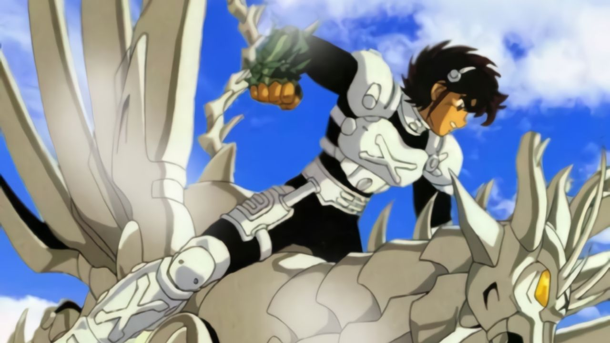

# BT'X: Cabalgando en un pegaso

Masami Kurumada, el creador de Saint Seiya (conocida aquí como Caballeros del Zodiaco) volvió finalmente al estrellato el año pasado con BT'x, un comic de combates y ciencia ficción en la vena de caballeros, pero con el toque de cyberpunk que tanto gusta hoy día.

El comic es publicado por editorial japonesa Kadokawa Shoten y la historia ha sido adaptada a una muy exitosa serie de dibujos animados de 28 capítulos. También se han lanzado al mercado infinitos model kits y muñecos, pero esta vez de la mano de la juguetera Takara en vez de Bandai.
