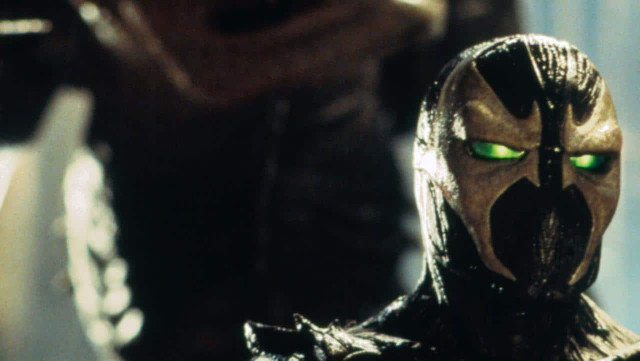

# SPAWN: Cine y TV ¿Llego la hora de su masificación?

El comic-book norteamericano mas exitoso de la década, Spawn, la creación de Todd Mcfarlane se esta por convertir en el primer comic de autor yankee en llegar a las masas, e intacto! Fieles adaptaciones a dibujos animados realizadas por HBO y una película actuada para cine, invadirán este año todo el mundo, junto a su ya clásica linea de muñecos ultra detallados que tanto aman los coleccionistas.
