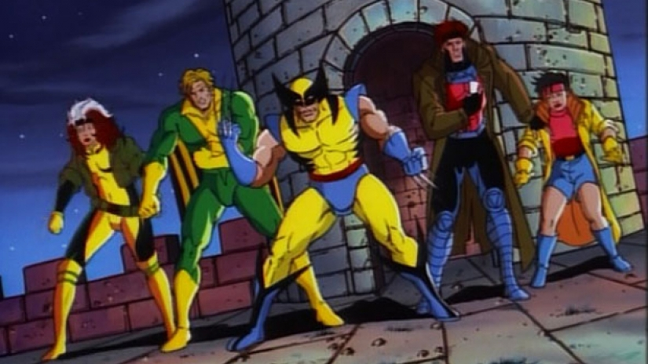

# X-MEN: Últimos Capítulos

La serie de tv de los X-men, una adaptación semi libre de uno de los comics mas vendidos del mundo, tocara su fin este año en USA.  
Para sus episodios finales los productores prometen un nuevo estilo de coloreado, nuevo diseño de personajes y una conclusión emotiva. Este nuevo estilo de dibujo, afirman, se parecerá mas al de Joe Madureira (el dibujante mas popular del comic en este momento) y menos al de Jum Lee (quien fuera el mas popular dibujante de X-men en el momento del lanzamiento de la serie tv y el responsable del diseño de sus trajes actuales).
