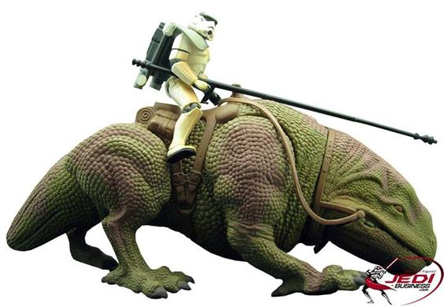
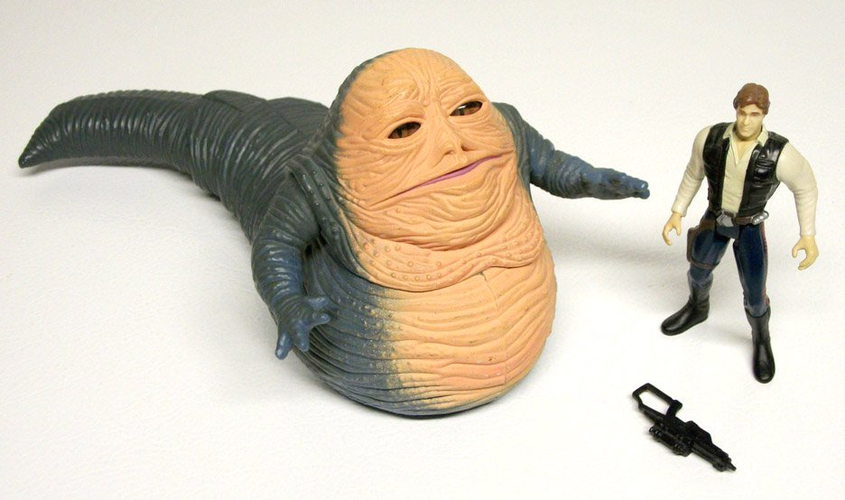

# Kenner contrataca

La linea de muñecos mas longeva y vendida de la historia, Star Wars, esta una vez mas entre nosotros.

Nuevas versiones de los personajes originales (un poco demasiado musculosas al principio y mas proporcionadas ultimamente) ya se encuentra a la venta en todo el planeta. "repaints" de las naves originales también han sido lanzados, asi como una linea nueva llamada "Shadows of the Empire".

La característica clásica de la serie, sacar hasta el personaje que apareció medio segundo en el fondo, afortunadamente se han mantenido.
