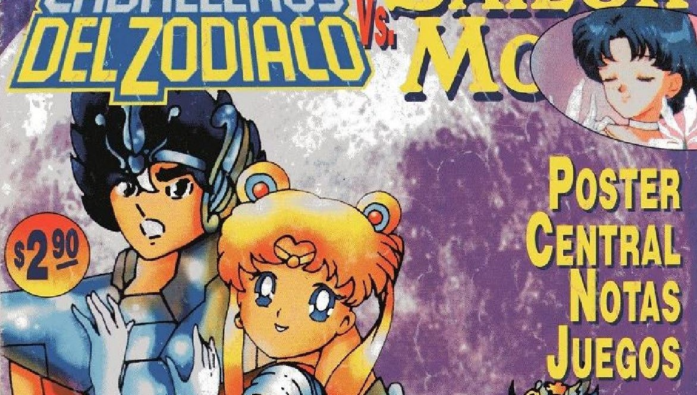
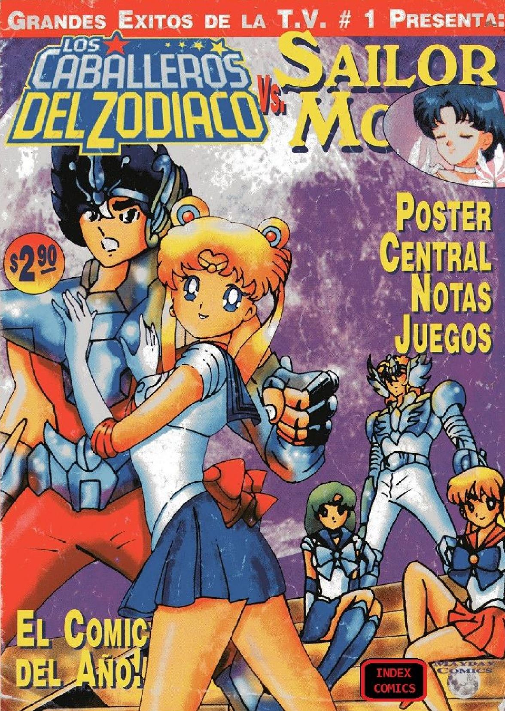
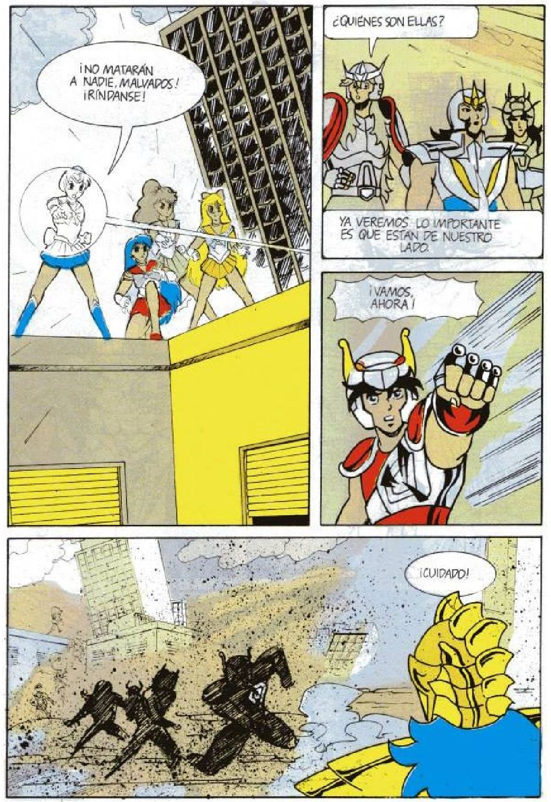

# Caballeros del Zodiaco Vs. Sailor Moon

Aunque el título y la tapa lo dicen todo, no podemos evitar comentar lo que hay dentro…

Porque, amado publico, esto no es una fanzine que cristaliza las fantasías de los/as fantásticos/as mas cebados, sino una revista a colores que hizo Dios sabe quien -y parece que fue en una noche- para venta en kioscos movido por un fanatismo muy distinto: el que rinde culto al vil meta.

Si no han podido gozar de esta joyita que nos enorgullece de ser argentinos entonces, por favor, tomen asiento y ajústense los cinturones que les haré un tour guiado. Aquí vamos…

Una vez adquirido el ejemplar, el lector comienza a hojearlo y deleitarse con toda la amplia gama de técnicas milenarias de las cuales hace gala el autor que, estamos seguros, le causaran inmediatamente un placer quasi-orgásmico:

- Técnica del afanum descaradum a las 3 a.m. con lo único que tengum: alias dibujos calcados con hojas canson.
- Técnica china de "con estum me cagum en el copyrightum" alias nombres de los personajes borrado a ultimo momento (a Luna la llaman gatita!!!).
- Técnica del apolliyum: alias caras y fondos que se olvidaron de colorear.

Pero sin duda con la que humilla y demuestra todo su talento es con la técnica de salpicado de tintas que aprendió tras graduarse de salita rosa… O la prosa, digna de shakespeare, que nos deja reflexionando con frases como "Tengan precaución" o "al ataque!"

¡¡¡Que pais generoso, por Dios!!!  
¡¡¡Que Mundo generoso!!!

El combo se completa con papel ilustración -no sea que se vaya a perder algo del complejo coloreado del Photoshop gracias al cual Ami tiene pelo verde-, tintas corridas, un póster central (uuugh…!) y, lo mejor, los juegos de la pagina final… "Ayuda a Hyoga a pasar el laberinto para tener su cita con Sailor Venus".

En algo si estamos de acuerdo con los anónimos autores de este engendro mutante: Realmente creemos que es "¡el cómic del año! como señalan en la tapa… siempre y cuando esa expresión no tenga implícita algún tipo de alusión a su calidad intrínseca…

Más, alabado fans la historia no termina ahí. Cierta editorial argentina los termino demandando por utilizar a estos personajes. Pero como este es un país inmensamente generoso, los demandantes tampoco poseen los derechos de tales cómics -y aun así los publican en sus revistas de entretenimientos para chicos. Desafortunadamente nuestros desinformados editores no lo sabían y empezaron a gastar en abogados…
