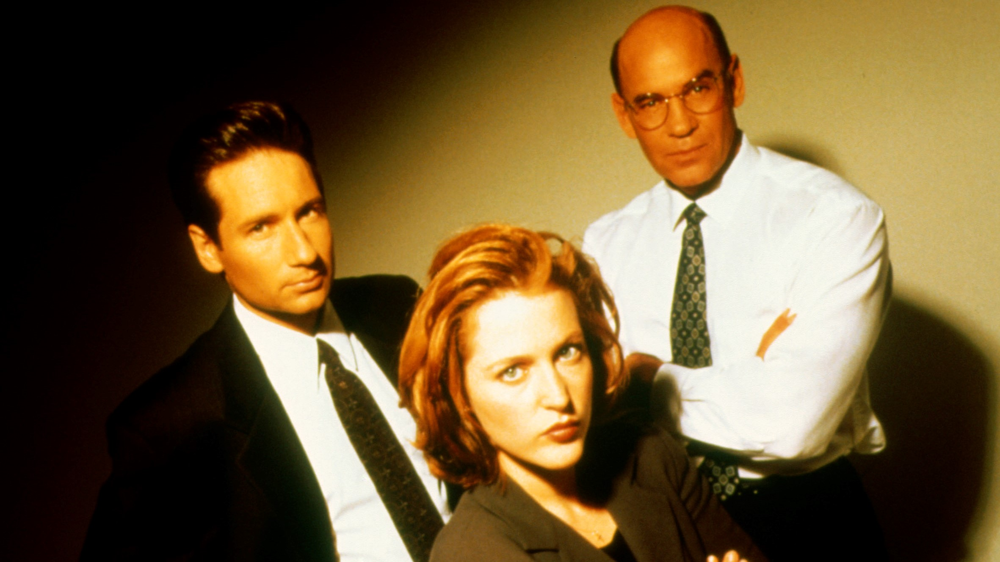

# X-FILES

Fox Mulder y Dana Scully, son los nombres de la pareja de investigadores del FBI que protagonizan esta serie, donde se nos cuenta los distintos casos (de corte fantástico científico) en los que se ven envueltos.

Resulta raro encontrar un producto para televisión (especialmente si es norteamericano) hecho con tanto cuidado e ingenio como X-Files. Esta serie no solo esta bien actuada, filmada y escrita, sino que además narra toda una compleja y continua historia de fondo sobre una gran conspiración que relaciona aliens, experimentos con humanos y su clasificación a nivel mundial, la cual se va desarrollando poco a poco a lo largo de sus varias temporadas. Toda una anomalía en una televisión llena de clichés e historias prefabricadas que no van a ningún lado. La clave de esto es sin duda la pasión y control que tiene sobre ella su creador: Chris Carter y el hecho de los dos actores principales (David Duchovny y Gillian Anderson) compartan ese genuino entusiasmo.

Esta famosa tapa de la edición australiana de Rolling Stone muestra lo que los espectadores fantasean y Chris Carter promete nunca sucederá.

Duchovny ha incluso co-escrito con Carter varios de los más brillantes capítulos centrados en la conspiración. La mayoría de los episodios tienen finales abiertos que dejan pensando al espectador. La frase "extreme possibility" parece ser la preferida por Carter para definir los temas que tratan y como los abordan. El humor negro es otro recurso que también suelen utilizar sutilmente. Nunca deja de sorprender la frialdad con la que Mulder y Scully se toman las cosas que ven… "Mira Scully, le aplastaron el cerebro y luego lo partieron en ocho", "Por el tipo de tajos diría que fue una motosierra" responde Scully sin inmutarse, "Es cierto, recogeré unas muestras de todas formas para analizar". Este podría ser sin duda un típico diálogo… Otro punto interesante de la serie es que se asegura que la pareja de protagonistas jamas se verá envuelta en una relación sentimental, aunque el publico no deja de fantasear con ello. X-Files es emitida prácticamente en todo el planeta en estos momentos, con gran repercusión en cada país. El éxito sin embargo, no ha dormido a los creadores en sus laureles sino que lo han aprovechado para hacer evolucionar la serie, llegando a tal grado de complejidad y confianza en si misma que recientemente incluso llega a prescindir de la pareja protagonista para algunos capítulos. -como el caso del que cuenta la juventud de Cigarette Smoking Man (uno de los líderes de la conspiración) y a quien en ese capítulo vemos asesinando a Kennedy por encargo y dando la orden de matar al primer alien descubierto en la tierra-.

Esta serie se la puede ver semanalmente en el canal Fox -que tiene opción sap para escuchar en ingles-, o en video, ya que los capítulos dobles han sido editados y están disponibles para alquiler o venta en versión subtitulada.
