# Dragon Ball: ¿La tercera es la vencida?

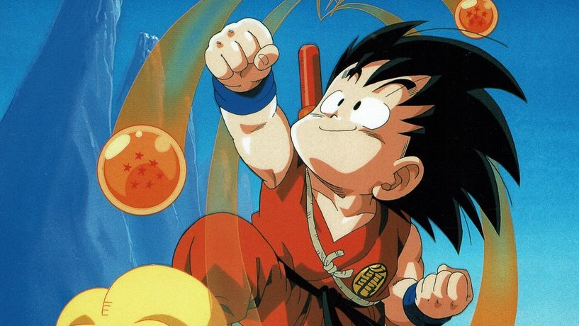

**Por Leandro Oberto**

Una vez más Dragon Ball llega a la televisión argentina, pero incontables cortes de escenas -algo sin precedentes en series dobladas directamente del japonés- tanto enfurecen a los fans como hacen temer por su éxito.

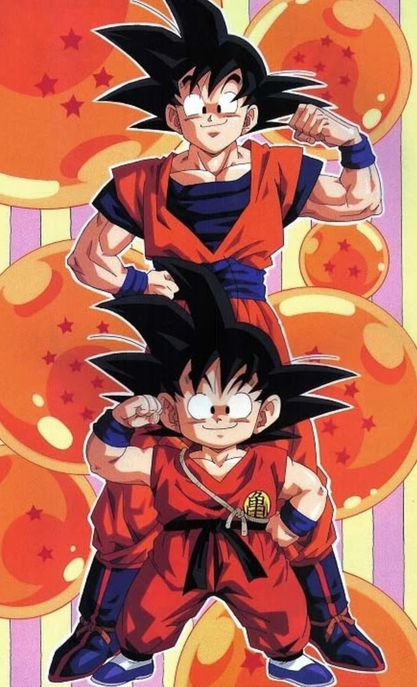

Dragon Ball, una de las series de dibujos animados más exitosa y con más capítulos en la historia de la televisión de este planeta se encuentra nuevamente centelleando en las pantallas locales. Pero la creación de Akira Toriyama parece destinada a ser distorsionada por empresas que intentan idiotizarla y quitarle sus chistes verdes antes de comercializarla cada vez que sale de Japón. ¿Es que acaso piensan que nosotros somos inferiores a los japoneses y no podemos ver lo que ellos ? Bueno… así cada uno tiene el país que tiene…

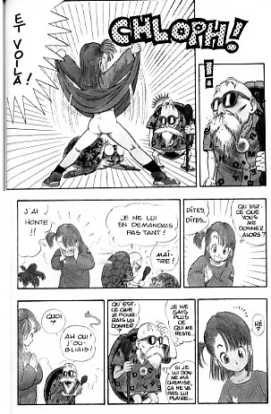

Aquí, en la versión cómic, podemos ver escenas que quitaron de la serie de tv al realizar el doblaje al castellano.

El tema de los cortes podría tener cierta sensatez (hablando desde un punto de vista exclusivamente comercial, claro, diez o mas años atrás cuando Japón era el único país en producir dibujos animados para todo tipo de audiencias mientras que en occidente eran considerados para chicos pero hoy dia en una televisión donde se emiten exitosamente The Simpsons, Duckman, Aeon Flux, The Maxx, Beavis and Butthead o The Critic y los mismos dibujos que ven los chicos durante la tarde (muchos de ellos japoneses) son vistos por los mayores en sus repeticiones de pasada la medianoche, la cosa no termina de tener lógica. Además sienta un desagradable precedente: al dia de hoy ninguna serie doblada directamente del japones al castellano había sido cortada/masacrada. En fin… si alguien conoce cómo contactar a los responsables de esto háganoslo saber así todos podemos bombardearlos con cartas en contra de su decisión.

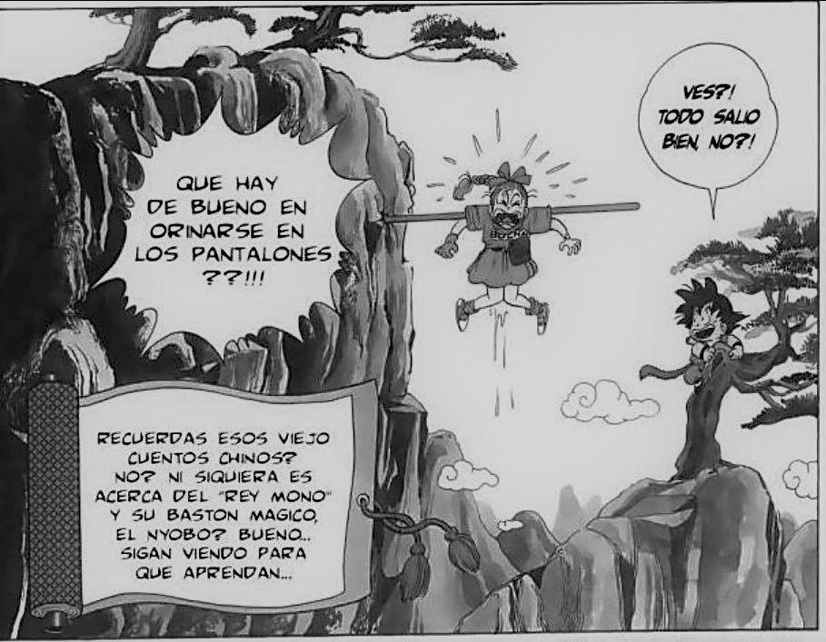

... y más escenas ...

Hagamos un poco de historia: DRAGON BALL hizo su primera incursión en la televisión argentina en 1994 cuando la empresa juguetera (hoy desaparecida) JOCSA llego a un acuerdo con BANDAI para comercializar los muñecos aquí. La cosa no terminó bien, los muñecos fueron un gran fracaso y las jugueterías al día de hoy todavía tratan de olvidar el mal trago. La razón: los muñecos correspondían a la segunda serie DRAGON BALL Z, mientras que en televisión emitían Dragon Ball, donde los personajes eran otros y tenían extraños nombres -Goku se llamaba Zero!-.

Solo un par de películas de Dragon Ball Z fueron emitidas. Pero sin aviso y, al igual que la serie en fragmentos dentro de otro programa y siempre en la pantalla muerta de ATC. Para ese entonces el organismo regulador/censor de la radiodifusión creado durante la época de la dictadura, el Comfer. -El cual según señalan muchos era un nido de corrupción-. Había anunciado planes para limitar los horarios de emisión de varias series y dibujos animados (Dragon Ball entre ellos).

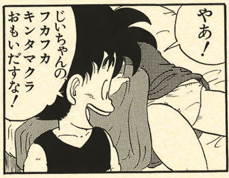
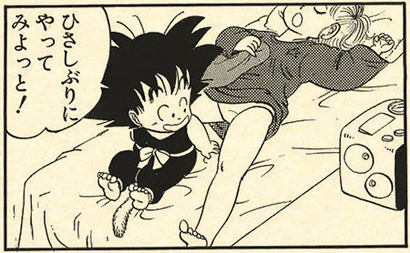
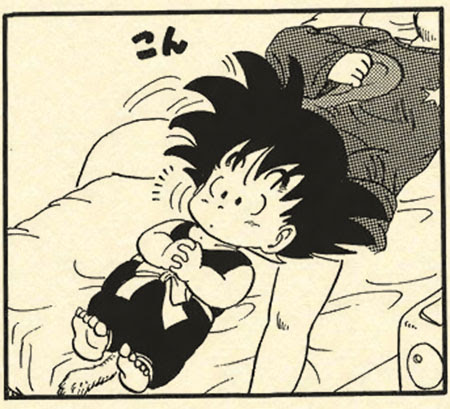
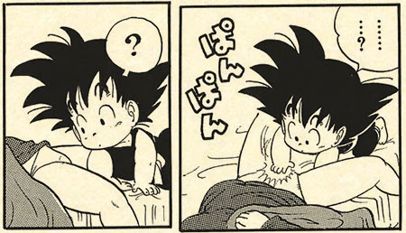
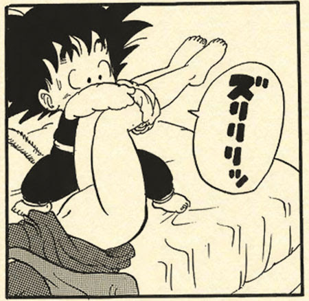
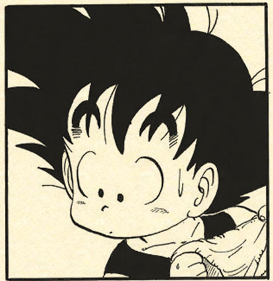
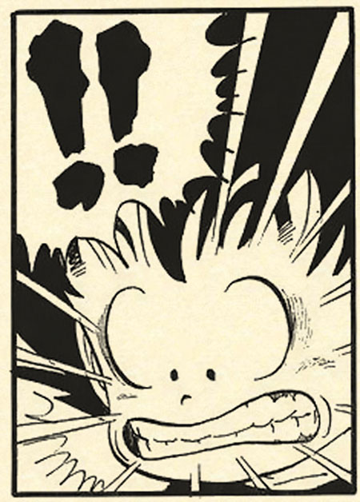
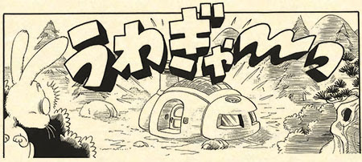
    

_Y todavía mas escenas, podríamos llenar toda la revista._

Afortunadamente la idea no solo no progresó, sino que gracias al esfuerzo de varios grupos de fanáticos que hicieron oír su disgusto logrando notas en diarios y radio (de hecho quien esto escribe fue uno de los impulsores) y enemigos políticos del organismo, el tema se convirtió en un escándalo que el ministro de economia, Domingo Cavallo, aprovecharía más adelante para eliminar a los dirigentes del organismo y fusionar sus restos con otro para reducir el gasto público.

No obstante, como Dragon Ball se dejó de emitir debido a su fracaso comercial y el cese de relaciones Jocsa-Bandai muchos fanáticos lo atribuyeron a una censura estatal. La teoría fue reforzada por patéticos pequeños artículos aparecidos en diarios y revistas donde comentaban que la serie había sido prohibida en Japón, dato totalmente falso que un cronista de pagina 12 -copio de un diario español (que se encontraba haciendo una campaña paga políticamente pro-regulación de tv). Obviamente en este país chequear la veracidad de la información no es algo que se le cruce por la cabeza a nadie, y su dato falso a su vez fue copiado por otras revistas, como "Noticias" y… -por Dios, que país generoso!!!

Los cierto es que la primera incursión de Dragon Ball hizo mucho ruido pero no llegó a captar espectadores.

En 1995 el canal Magic emitió nuevamente los 11 capítulos que se habían visto en 1994 siendo bien recibido pero olvidado rápidamente al durar tan poco.

Una curiosidad de esos capítulos emitidos en 1994 y 1995: los primeros 5 estaban doblados de una adaptación piloto realizada en 1987 en USA por Harmony Gold -incluso la canción de la presentación estaba en inglés- y se encontraban fuertemente cortados. Mientras que los restantes -traducidos del japonés en México- estaban absolutamente intactos y eran un fiel doblaje de lo visto en Japón.

Eso nos lleva a 1997, Bandai ahora radicada en la región no está dispuesta a que los malos tragos del pasado impidan que su propiedad mas exitosa y duradera no sea comercializada aquí. En 1996 en México los primeros 60 capítulos de la primera serie fueron doblados al castellano y eso es lo que se está emitiendo aquí. Intertrack realizó el doblaje, Empresa que pese a haber hecho un excelente trabajo con Sailor Moon aquí no demuestra su talento y utiliza a actores bastante poco expresivos y que en muchos casos no parecen adecuados a los personajes.

Al poco inspirado doblaje hay que sumar el hecho que casi todas las referencias a chistes de origen sexual o flatulento fueron eliminados mediante cambio de diálogos o eliminación de escenas y obtenemos un Dragon Ball que no se parece como debiese a su versión japonesa. ¡Ha Perdido su desenfado y guiños al espectador que lo hacían único!

¿Podrá este extraño pariente de DB tener éxito pese a sus limitaciones?

¿Que tiene a favor?, intensa rotación en el segundo canal más visto de Argentina -Magic- (primero esta HBO Ole), se emite diariamente los 7 días a la 7:30, 13. 19:30 y 0:30 de la mañana (el horario favorito de los fans), la presentación y el ending tienen versiones en castellano de los temas originales pero fielmente traducidos y con el cartel "basados en la historieta Dragon Ball de Akira…etc". Además estar disminuyendo conforme avanzan los capítulos y todos los nombres son los originales japoneses.

Lo único que queda es esperar y ver como termina esto.

## Dragon Ball: El Comic

### Datos Técnicos en Síntesis

DRAGON BALL es un cómic de origen japonés creado por Akira Toriyama en 1984 para la revista Shonen Jump de la editorial Shueisha y que se publicó constantemente hasta su finalización en 1995 debido al cansancio del autor. Se encuentra recopilado en 42 tomos.

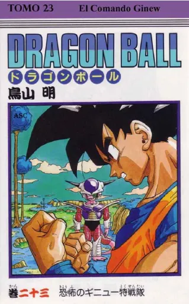

Toda la historia se ha adaptado a la animación a través de 153 capítulos de Dragon Ball y 291 de Dragon Ball Z (que narra las aventuras de Goku cuando es mayor e incluso las de su hijo), asi como también una serie de películas que cuentan más resumidamente la misma historia.

Hay también en Japón en este momento una tercer serie de tv. Dragon Ball GT que continúa la obra de Toriyama (más allá del final del manga) bajo su supervisión y de la cual ya hay más de 40 capítulos. Siendo emitida por Fuji tv en el mismo horario en el que ha permanecido durante estos 11 años, miercoles 19:30hs.

Tanto tomos originales japoneses del cómic como traducidos en España están disponibles en los negocios de comics. No hay noticias sobre una eventual edición en Argentina, una de las razones posibles de ellos es que hoy día la editorial japonesa exige como condición que sea editado en el sentido de lectura usado en Japón: Derecha a izquierda, atrás para adelante (o sea al revés de lo que estamos acostumbrados).

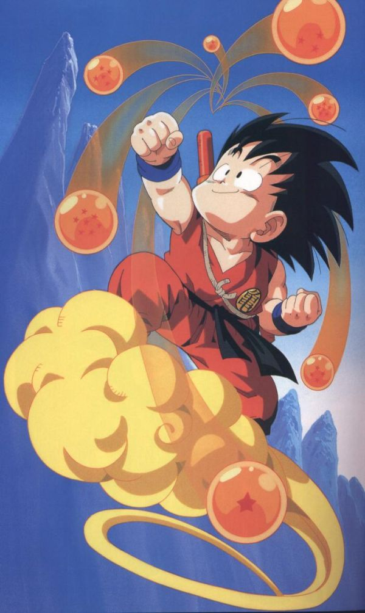