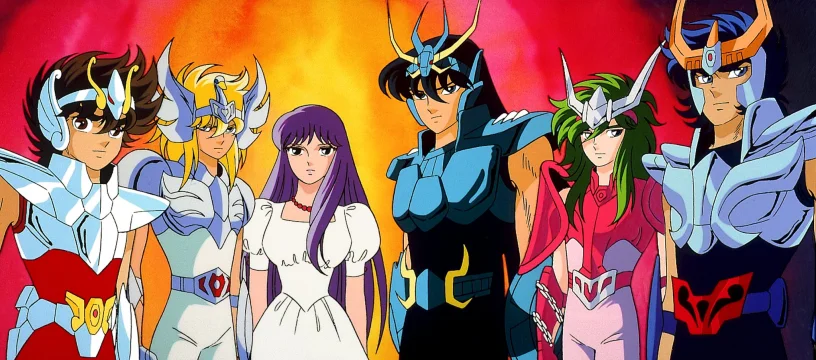
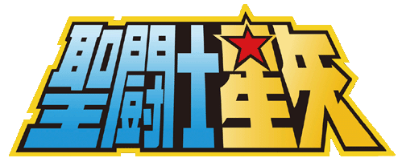
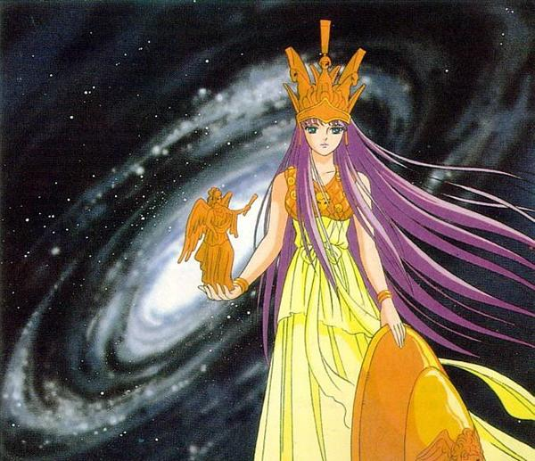
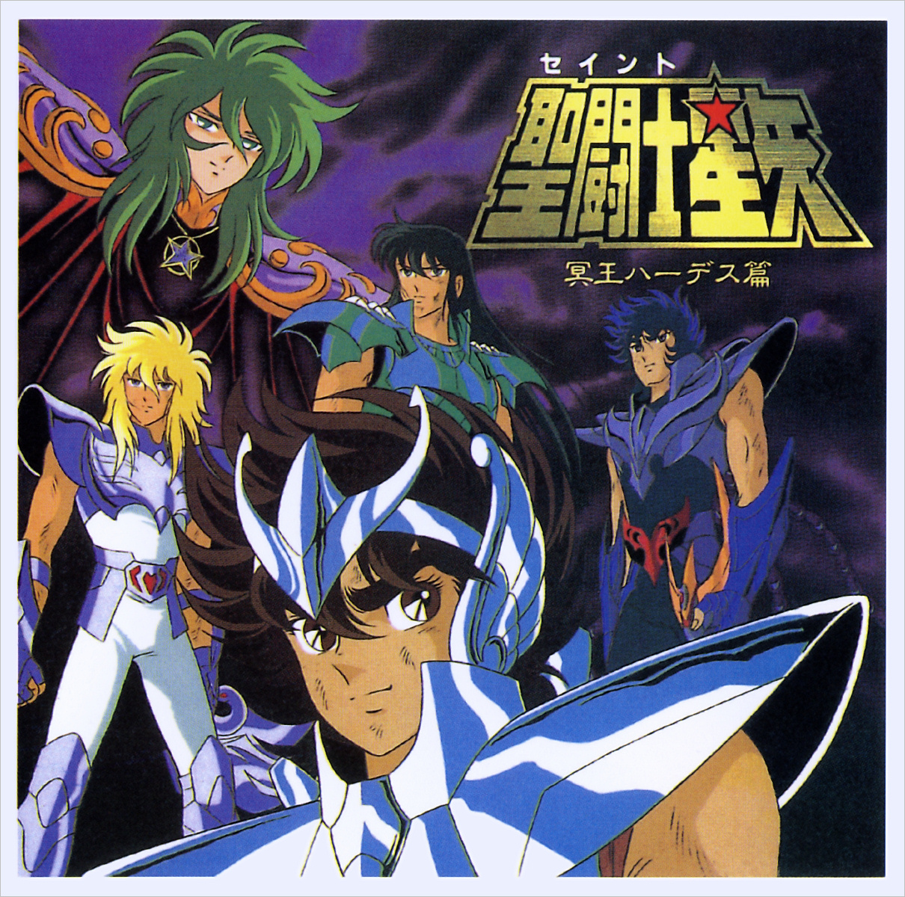
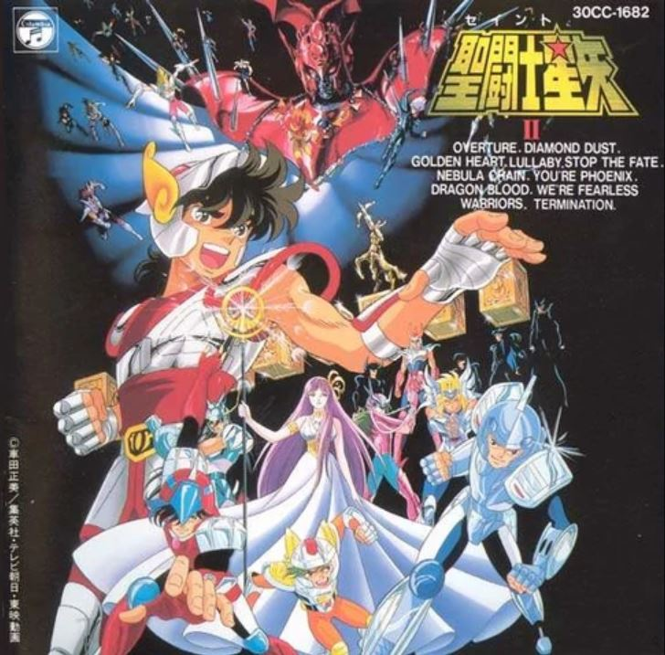
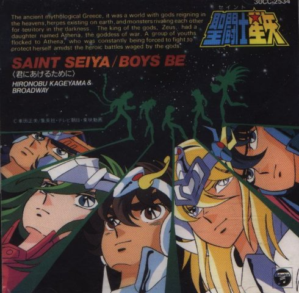
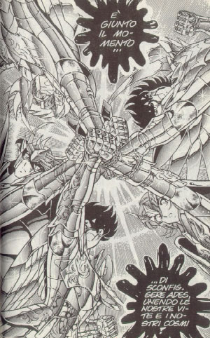
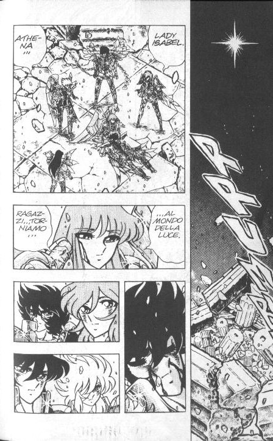
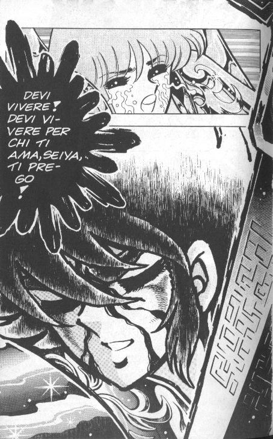

# Caballeros del Zodíaco: Historia y Gloria

**Por Leandro Oberto**

Sin duda una de las razones por la cual esta exitosa serie va a ser recordada es por haber sido la punta de lanza de lo que se convertiría una nueva oleada de dibujos animados japoneses en la tv local. La repercusión obtenida en Brasil, Argentina, y México(los tres mercados principales de la región) refrescaría el concepto de animación japonesa como sinónimo de éxito en toda américa latina.

El nombre original de la serie es Saint Seiya, en honor al protagonista y protector de la reencarnación de la Diosa Atena.

Caballeros del Zodiaco, la serie de tv, es la adictiva historia dividida en tres sagas (comúnmente conocidas como: El Santuario, Asgard y Poseidon) que narra las aventuras de 5 jóvenes guerreros que deben proteger a Saori Kido, la reencarnación de la Diosa Atenea para que la paz se mantenga en la tierra. Está cargada de referencias mitológicas, un revaloramiento constante de la amistad, grandes dosis de sangre y humor negro, flashbacks en los cuales vamos conociendo la historia de cada personaje y caballeros de dudosa hombría que resultaran realmente divertidos.

Este anime (terminó con el cual los fanáticos occidentales suelen referirse a los dibujos japoneses) está basado en un cómic japones iniciado en 1986 y concluido en 1991 realizado por Masami Kurumada y publicado por la editorial Shueisha en el Shonen Jump, la revista de cómics mas vendida del mundo. Luego recopilando en varias decenas de libros/tomos. El nombre verdadero de la serie es Saint Seiya, en honor al protagonista obviamente. Caballeros ha cosechado un enorme éxito tanto en Japón como en diversos países europeos y del este asiático durante el final de los ochentas y hasta mediados de los noventas.

Se han realizado unos cuantos millones de muñecos, remeras, posters y artbooks, pero eso es toda otra historia. En esta primera nota de Lazer sobre Saint Seiya queremos darles un pantallazo sobre todo lo que se ha realizado en cómic o animación con esta serie y cuanto de ello nos ha llegado.  

## Animación: Las Series de tv

### SAINT SEIYA (PRIMERA SERIE)

- 73 capítulos, emitidos en Japón a partir de octubre de 1986
- Rediseño de personajes para tv: Shingo Araki
- Dirección: Kozo Morishita

Originalmente planeada para durar 52 capítulos la serie fue tan popular que se extendió hasta los 73. Todos fueron emitidos en Argentina, esta etapa abarca hasta el final de la lucha de las doce casas. En la versión local de la presentación y el ending fueron alterados, una cancion inventada y cantada con fuerte acento español e imágenes de una película posterior de fondo, hacen de presentación y ending sin guardar ninguna similitud a sus versiones japoneses, cuyos temas musicales (pegasus Fantasy y Blue Forever) se harían muy famosos. Fuera de ello la serie está correctamente doblada, manteniéndose sin la mas mínima alteración todos los capítulos y sus correspondientes músicas de fondo, tal cual se viera en Japón. El doblaje fue realizado en México.

Emitida en Argentina desde abril de 1995.

### SAINT SEIYA (SEGUNDA SERIE)

- 41 capitulos, finalizada en Japon en abril de 1989
- Rediseño de personajes para tv: Tadao Kubota
- Direccion: Koozo Maorishita.

Con una animación y colorido notablemente mejores y el estilo de dibujo que se pondría de moda esta década en Japón, comienza la segunda serie que abarca las sagas de Asgard y Poseidon. Cabe señalar que la saga de Asgard fue inventada expresamente para la tv y no existe en la versión original en cómic de Masami Kurumada. Esta serie contaba con una nueva presentación en la que se veía a los caballeros con las nuevas armaduras mientras tocaba de fondo el tema Soldier Dream, pero en la versión en castellano también fue reemplazada por la misma que utilizaron para la primera temporada. La serie en si, al igual que en la primera, también permanece intacta y es un fiel doblaje lo visto en Japón.

Emitida en Argentina desde diciembre de 1995

## Animació: Las Peliculas

### SAINT SEIYA PRIMER PELICULA: LA REENCARNACION DE ELLIS

- 1987, Toei animation
- 45 minutos

Una breve película que al igual que las otras tres que se realizarian contradice la continuidad de la series, por tanto se supone transcurren en una especie de "universo alternativo". La animación es algo más fluida que en la serie de tv y están presentes todos los elementos que hacen a una saga de caballeros condensados en menos de una hora.

Una versión doblada al castellano fue editada en video para su venta a través de kioscos a finales de 1996 por editorial Vértice. Cabe notar que en esta edición en video podemos finalmente apreciar la presentación original japonesa de la primer serie con todos sus créditos originales y el famoso tema "Pegasus Fantasy". Este hecho de por si, la hace muy recomendable.

### SAINT SEIYA SEGUNDA PELICULA: LA ARDIENTE BATALLA DE LOS DIOSES

- 1988, Toei animation
- 45 minutos

Esta película es una de las más elaboradas a nivel gráfico. Se utilizó para testear los conceptos sobre Asgard que luego emplearía Toei animation para inventar la primera parte de la segunda serie de tv. También editada para venta por quioscos en video por E. Vértice en Argentina a finales de 1996 y también contiene la presentación de la primera serie en su espectacular versión japonesa. Además, en los créditos del final figuran incluso los nombres de los dobladores. Una edición impecable.

### SAINT SEIYA TERCERA PELICULA: LA LEYENDA DE LA JUVENTUD ESCARLATA

- 1989, Toei animation
- 70 minutos
- Conocida en Argentina como: Caballeros del Zodiaco: la pelicula

La más extensa, y según muchos, mejor lograda película de Caballeros del Zodiaco. Los cinco Saints enfrentan a Abel, que ha seducido a Saori. Esta película se puede ver en los cines argentinos en Julio de 1996, cosechando bastante éxito de público y crítica.

Doblada en México, conserva la presentación y endings realizados especialmente para la película en Japón. Disponible para venta o alquiler desde finales de 1996 en la edición de Gativideo.

Otra versión doblada en España (muy fea) también circula desde 1994 por los negocios de comics de Argentina. La particularidad de esta era tener el ending reemplazado por una versión en francés de la presentación que se vio en televisión (ajjj!!!)

### SAINT SEIYA CUARTA PELICULA: GUERREROS DE LA BATALLA SAGRADA FINAL (lucifer)

- 1990, Toei animation
- 45 minutos

La ultima animación de Saint Seiya que se realizo, nos muestra a los caballeros combatiendo a Lucifer, quien clama haberse vuelto mas poderoso al absorber la fuerza de Ellis, Abel y Poseidón cuando murieron a manos de los Saints. ¡Como en todas las películas contradicen la continuidad!. Editada en video para su venta por kioscos por vértice esta disponible en Argentina desde febrero de 1997, y en ella se puede apreciar la presentación original japonesa de la segunda serie de tv, la del tema Soldier Dream.

De esta forma cerramos el repaso a todas las animaciones realizadas de la serie, que como habrán podido comprobar fueron lanzadas al mercado argentino en su totalidad

### El Final

La historia de Seiya no concluye con los dibujos animados. En el manga (cómic japonés), Masami Kurumada realizó una linea argumental final, en la cual los caballeros se enfrentan a Hades. Historia que nunca fue animada y tampoco editada en castellano. La única oportunidad de leerla para los que no saben japonés es conseguir la versión italiana (la única occidental) de Granata Press, ¡en cualquier negocio de comics de ese país!

Los dibujos del comic son raros, chocantes en comparación a los de la serie de tv. Pero en esta saga llegan a tener un particular encanto.

La historia concluye con la derrota de Hades, pero sorpresivamente también con la muerte de Seiya en la batalla final y ¡Saori declarandole su amor! Kurumada así se las ingenia para darle una vuelta interesante a la saga y poner punto final a la serie.

Saint Seiya había acabado, pero toda una oleada de series de similares características invadieron las pantallas japonesas, ejemplo de ello son Samurai Troopers (aqui emitida como Samurai Warriors y algo retocada en USA) y la mucho más inspirada y orientada a la ciencia ficción, Shurato, que siendo un éxito en Brasil en estos momentos se espera llegue a Argentina antes de fin de año.

Sin duda el espíritu de Saint Seiya vivirá con nosotros.

> En próximas Lazer encontrarán notas sobre la vida de Kurumada, guía de capítulos de caballeros del zodiaco, análisis de los compact-discs, los muñecos y cuales no se llegaron a comercializar aquí, etc.