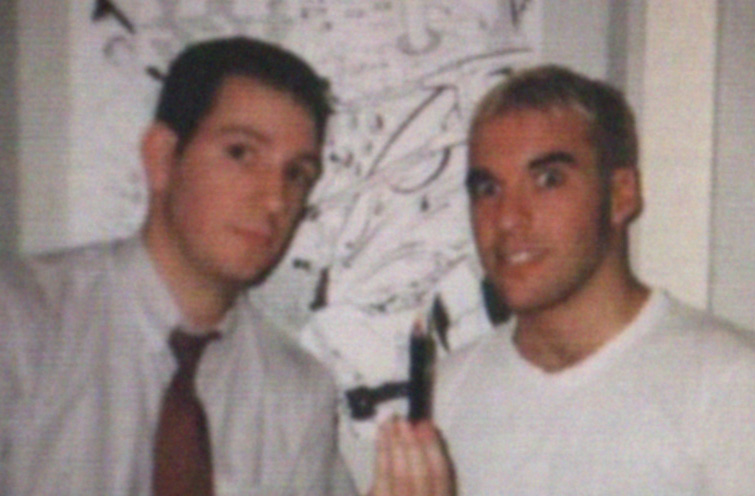
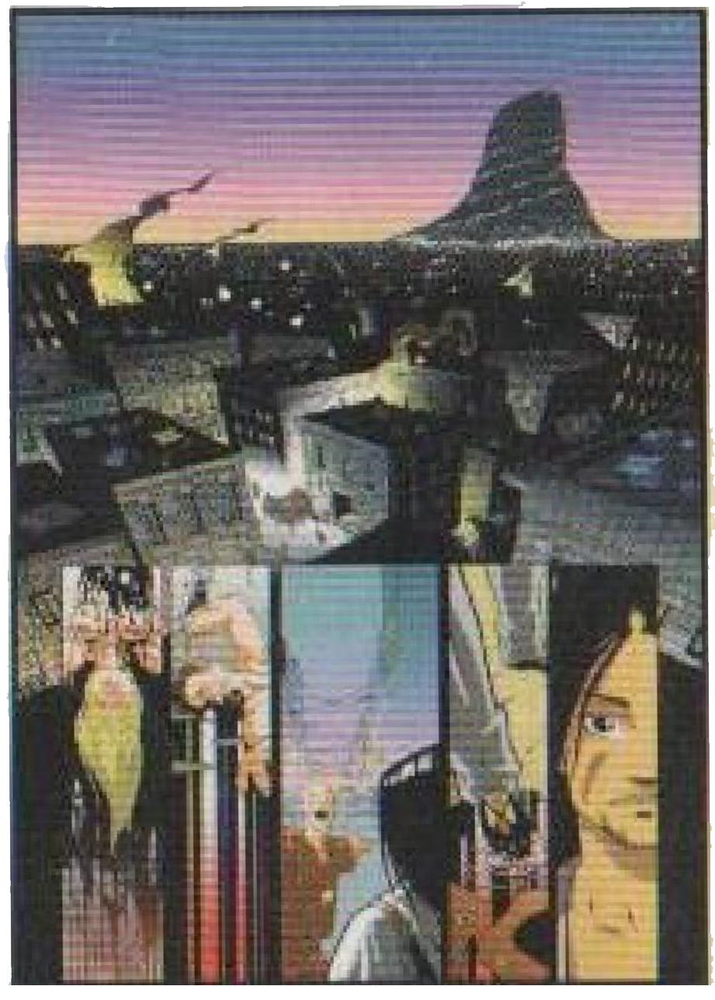
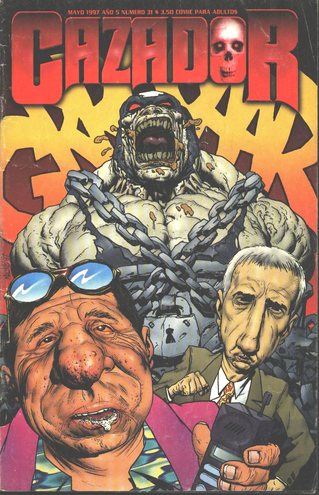
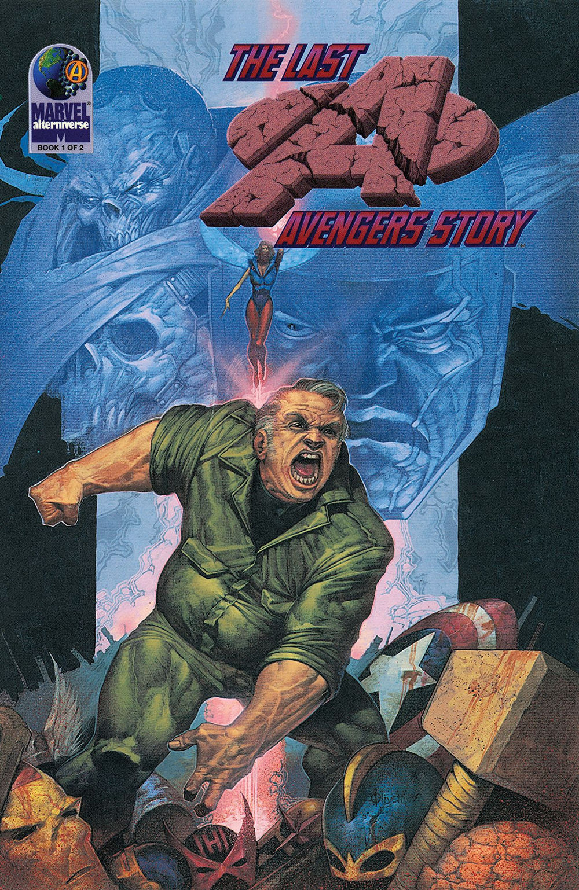
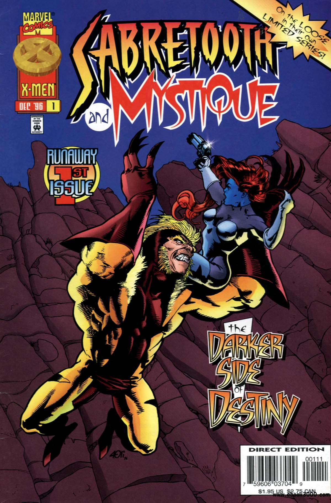
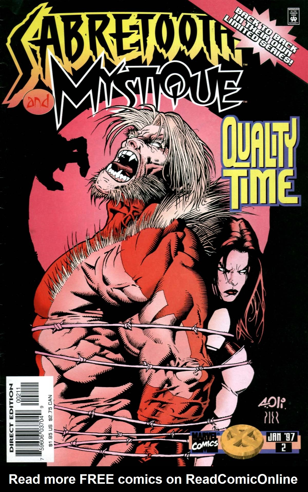
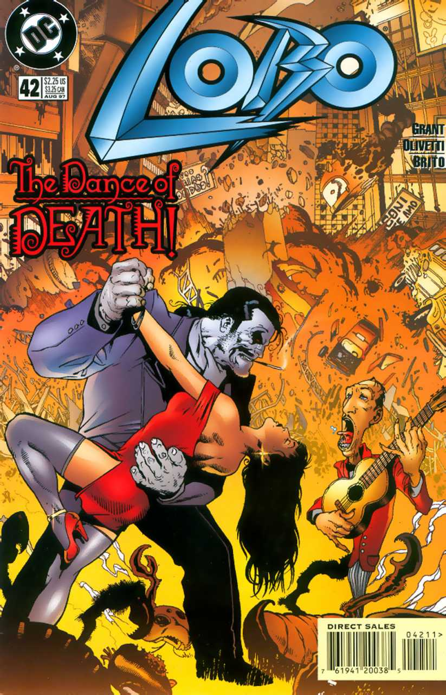
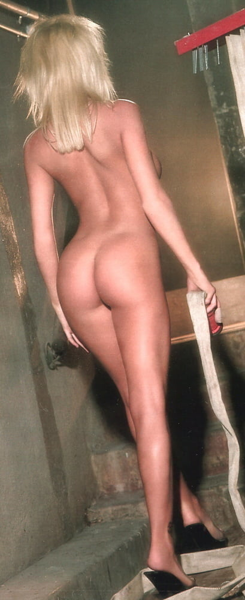
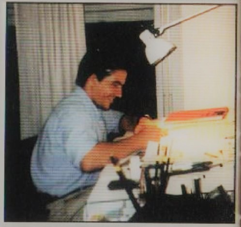

# Olivetti y Brito: Dibujantes for export

**Por equipo Ivrea**

Situado en Caballito, el tradicional barrio de la ciudad de Buenos Aires, pero lejos de sus zonas céntricas más típicas se encuentra un particular estudio creativo.

Allí, un grupo de dibujantes, entre faxes, computadoras, aerografos, papeles, los más diversos muñecos, posters y libros, diariamente crea comics que llegarán a los más recónditos rincones del planeta.

DC comics, Marvel, Verotil, Event y tantas otras compañías han visto en ellos el talento que necesitaban para sus revistas.

Pier Brito sale de su cuarto de dibujo para mostrarnos como colorea paginas de "Aldus y el vampiro" y prueba formas de coloreo para su proyecto predilecto: "Crónica de la cosecha", -"Una inquietante historia y análisis de las facetas más oscuras del ser humano y la religión como forma de dominación. Todo mezclado en una épica historia cósmica". Como el la describe. El primer libro de este cómic sera publicado por Editorial Ivrea hacia fin de año, al igual que el otro proyecto en el que Pier está trabajando junto a Leandro Oberto "Convergencia", una serie de ciencia ficción en veintidós capítulos con ingredientes de espionaje, aventura, romance y existencialismo.

Página de "Cronica de la cosecha", el proyecto de Pier para fin de año.

\-"Estos proyectos realmente revolucionaran el cómic en Argentina y esperemos algún día todo occidente" dice Pier en joda pero entusiasmado.

Mientras seguimos viendo varias personas dibujando, charlando y consultando imágenes, aparece el mas veterano del lugar, Ariel Olivetti, a quien entrevistamos en una prolongada charla en la que no faltaron los chistes, las interrupciones para comer y un torpe movimiento mio con el cual derrame su mate a escasos centímetros de un original!

¿Como te metiste en esto?¿que es lo que te hizo decir "tengo ganas de meterme a trabajar en los comics"?

El gustarme dibujar, aun mas que contar historias: dibujar lo que sea. Cuando era chico prendía el televisor y se veían dibujos como Meteoro, Astroboy y los dibujos de Marvel de Kirby, los tres chiflados…

¡Eso no es un dibujo animado!

No, pero tiene mucho que ver con el comic…

Bueno, y así me pasaba las tardes dibujando mientras miraba los de Marvel, dibujaba lo que veía. Hacia montones de escenas en la misma pagina y sin cuadritos, ¡un quilombo!

La primer historieta que realmente lei -no que mire los dibujitos solamente- y me gusto fue la de Nippur de Lagash de Lucho Olivera; tenia diez años y me partió la cabeza.

Después empece a leer Fierro hasta que descubrí comics yanquis de Richard Corben y toda esa onda de dibujo. Siempre más interesado por los dibujos que por la historia.

¿En Fierro te metiste a trabajar?

Si, termine haciendo ilustraciones para ellos, debo haber hecho como diez tapas.

¿Tu primera historieta profesional?

Uhm…

Había hecho algo para Óxido y después Barreiro nos había propuesto a Mauro y ami hacer una historieta que se llamaba Virus -que aun hoy no ha sido publicada aunque se especula que pronto lo hará, pintada a mano.  
Tardamos un año en hacer 22 páginas, probamos distintos estilos en cada una y fue medio desastre, salió una chotada. Pero gracias al training que me dio pude entrar en Marvel…

¿El primer cómic para Marvel fue la mini de dos prestige "Las Avengers Story", no?

Claro, todo pintado a mano. Lo empece a hacer en 1993 o 94 y el comic salio a mediados del 95. Tarde un año y medio en hacerlo. Antes de empezar con eso estaba haciendo Cazador en blanco y negro, y eso era algo donde no se veía demasiado la calidad de narración. Pero al ser algo nuestro no había presión editorial, nosotros hacíamos las reglas.

¿Cuanto Ariel Olivetti había en los primeros números del Cazador?

Y había… que se yo… agarra las cazador a color de ahora y los primeros números en blanco y negro… La diferencia era mi parte, porque el resto siguen siendo los mismos.

Todo lo que hacen ahora los chicos de cazador era lo que hacían antes cuando estaban conmigo… o yo con ellos.

En esa época nos veíamos mucho mas, había un intercambio de ideas, chistes y el trabajo era divertido, no de pensar "hay que entregar 3 paginas para mañana". Total estábamos convencidos que iba a fracasar.

¡Linda mentalidad!

Bueno, el saber que lo leíamos nosotros solos nos daba mucha libertad… hoy día hay gente que piensa que conoce su publico y se aferra estúpidamente a una dirección.

Cuando haces algo por amor al arte es mas divertido. Y así empezó Cazador, papel de mierda, sin publicidad…

Pero de alguna forma vendió algo, tal vez porque los lectores entendían que la gente se divertía haciéndolo, Lucas y yo hacíamos el correo y nos divertimos mucho. Cuando se empezó a apuntar demasiado a un publico quedaron de lado muchas cosas. Lo mas divertido eran las cosas que pasaban en el fondo, y eso hacían que la revista no se leyera en diez minutos. Hoy día es otra cosa, es todo muy profesional, una sola persona dibujando, casi a la carrera… se nota que no se divierten como antes.

Uno de los trabajos favoritos de Ariel, The Last Avengers Story

¿Tuviste que sacrificar parte de la forma de dibujar para adaptarte a editoriales norteamericanas?¿En que editorial te sentís mas Ariel Olivetti?

Donde mas me pude poner las pilas es en las ilustraciones, de las historietas donde mas fuerza le pongo, es en lo que estoy haciendo ahora, la Liga de la Justicia (Justice League escrito por Grant Morrison).

Pase por un periodo donde agarraba todo y quede muy saturado, ademas la calidad disminuyo. Ya no estoy haciendo dos o más cómics al mismo tiempo, así ahora lo estoy disfrutando de nuevo y no tengo que depender tanto de los chicos que trabajan conmigo. En lo que hago de la liga hay mas amor que laburo, al igual que en el primer numero de Last Avengers Story.

¿Es cierto que te obligaron a dibujarle un short a una mina porque se le veia el culo en Last Avengers Story?

Si… bueno, no conocía las reglas. Allá hay revistas que llevan un sellito (del arcaico comics code) que te obliga a seguir ciertos lineamientos…

Pero ese comic no lo llevaba…

Bueno, asi es Marvel…

Olivetti y Brito experimentando con X-Men, en la miniserie Sabertooth/Mistique.

¿Pensas que la falta de sexo en los cómics americanos de aventura disminuye sus ventas?

No… aunque se podría hacer algo mas sensual tipo cine; porque acá en los cómics yankees parece que muy pocos se dan cuenta que puede haber algo en el medio, entre la pornografía y el cómic puritano. De todas formas es obvio que los personajes femeninos de superhéroes no son asexuados… todos andan diciendo "que buenas tetas, que buen culo" ademas es sexo como lo puede entender un chico que lee X-Men, alguien de mas de 20 como yo no compra X-Men…

Bueno, en el negocio de comics donde trabajaba tenia decenas de hombres y mujeres de mas de treinta que justamente compraban titulos de X-Men de entre todo lo que podían elegir…

Si… puede ser, pero no va dirigido a ellos…

Ese es el problema por desgracia hay un montón de este tipo de gente comprando el producto pero la editorial no se preocupa de ellos…

Si… si… pasa que hay otro espacio para esos clientes, en USA están los comics de Dark Horse, la linea vértigo de DC comics.. ¡que son comics realmente buenos!, se supone que el superheroe es un lector que necesita una identificación… y toda esa explicación psicológica de siempre. Super héroe clásico digo, tipo con capa que vuela, claro. De esos que no se enamoran nunca ni cogen, etc.

No todo eso que hay hoy día…

De eso queda poco, pero queda.

Un tipo que se separo de su mujer, tiene al hijo llorando o no le alcanza la guita para llegar a fin de mes necesita algo mas… algo tipo Sin City.

Pero es mucho mas fácil producir cosas en masa, cosas pelotudas, porque para hacer algo bueno se necesita talento y eso no lo encontras en todos lados.

Aparte es muy peligroso cultivar a tu publico, una vez que le diste buena comida a tu comensal el siempre va a querer comer eso. Para una editorial no es bueno hacer un comic de calidad, porque el día que deja de tener a tal o cual autor de puta madre, cago a toda la linea. Mas les vale sacar ese tipo de cosas como especiales o prestiges. por ejemplo: cuando Jim Lee, Marc Silvestri y toda la banda de dibujantes innovadores de X-Men y Spiderman se fueron de Marvel para armar Image, las ventas de Marvel se fueron al recarajo. El público no acepto el descenso de calidad, que no era un peldaño, era un abismo.

Después se preguntan "¿Que paso?"

Olivetti: "El perro que nos coloreo Sabertooth Mystique es un puto mal parido".

¿Basas tus personajes en gente real?

No, mayormente porque no soy capaz de dibujar caras parecidas demasiado tiempo. La excepción seria si tuviera modelos para dibujar, Aunque cada tanto una boquita de alguien, unos ojos de tal…

¿Que referencias utilizas?

Miles, y miles de libros con fotos o de anatomía. De los que tienen fotos de cúpulas a los artbooks de dibujos animados japoneses.

¿Planes para el futuro?

Ahora estoy haciendo este número unitario de Justice League, que me gusta mucho. Tengo propuestas de Verotik pero parece que no le andan muy bien las finanzas.

Tapa de "Lobo Tango" (Lobo #42), DC Comics

De cualquier forma se que nunca me va a faltar laburo porque lo hago con ganas, y eso cuenta. No podes tomar todo el laburo que te ofrecen porque te quemarías, y en poco tiempo, ¡adiós trabajo!.

Como dije, hace unos meses estaba tomando todo y mi calidad bajo mucho… prefiero hacer uno y bien.

A largo plazo me gustaría poder publicar también acá, pero con los números que se manejan hoy en dia no me alcanzaría para vivir. Hoy estoy muy en bolas, aun de Estados Unidos me deben una pila de guita. También me robaron plata en el correo…

¿Lobo Tango para DC comics?

Las modelos que quisiera tener Ariel para dibujar

Lindo, divertido. Pero no pudimos gastarnos todo lo que deberíamos porque estábamos haciendo otras cosas. Esta piola. Me parece muy divertido tener a un personaje yankee aca, el guion es muy zafable. Aca en Buenos Aires estoy seguro que va a vender muy bien porque es una rareza. Aparece un museo de armas de Evita, los bichos de Eternauta… La vaca sagrada del comic argentino que confieso, no logre terminar nunca.

¿Hay mas cultura de comic acá o en USA?

Bueno, hay mas artistas por persona acá. Pero el mega mercado de 300 millones de alla cuenta mucho. Hay muchos excelentes argentinos aun artistas yankees como Mignola (que me encanta) y Bisley están haciendo cosas que Breccia hacia antes. De todas formas lo bueno argentino termina llegando al exterior, una de las cosas que me llamo la atención en la última convención de San Diego es comprobar que mas allá de los dibujantes famosos de Estados Unidos el resto es de madera… -son unos perros!.. ¡malos malos!

¿Como se reunió la gente que trabaja en el estudio?

Marcelo y Juan eran alumnos míos en el taller de historietas que tenia y a Pier Brito lo conocí por un concurso de la revista Comiqueando… Concurso que perdió, claro.

Los jueces de la revista son gente muy especial… Les pareció que Pier no servía… ¡Así que Pier no le quedó otra que trabajar para Marvel! ¡ja ja!

¿Donde es mas fácil trabajar, en tu casa o en un estudio?

Tenes que tener tu espacio, en tu casa está el teléfono, la tía Sunta, la heladera, el televisor… Siempre hay algo que te distraiga. Sin duda es mejor estar en un estudio.

Pier Brito en el estudio realizando el coloreado de "Aldus y el Vampiro"

Y aun peor si vivís con tu familia… que te dicen "anda a sacar a pasear el perro, compra esto o aquello".

Viviendo solo es mejor, tu casa se convierte en tu oficina hasta que se convierte también en tu bulo. Entonces aparte de la tv, la heladera etc ¡tenes la cama!

¿Pierde o gana calidad artística un hombre para dibujar estando con una mujer?

…¡No pierde, definitivamente!, es malo que el hombre esté solo, la mujer te inspira.
