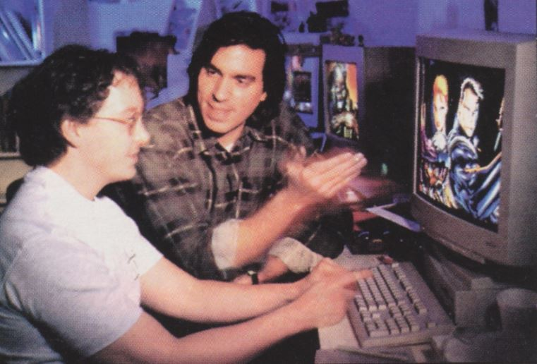
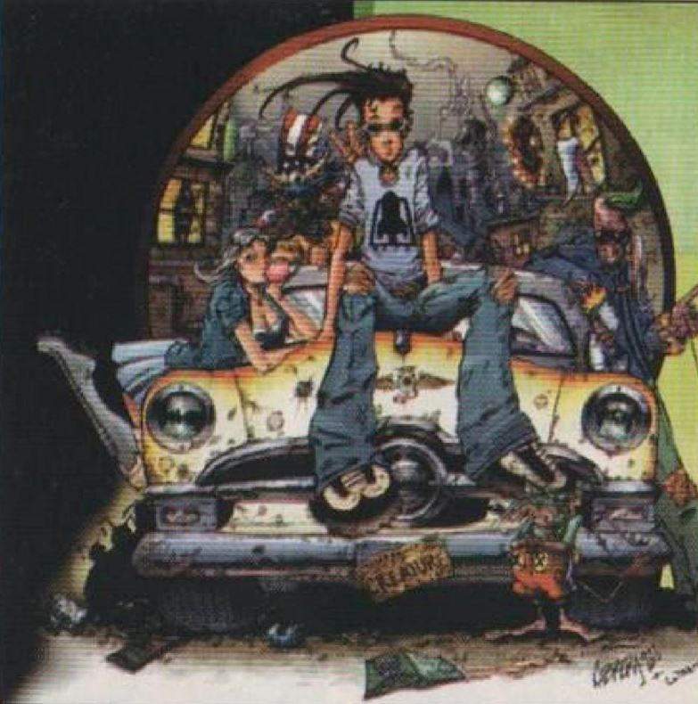
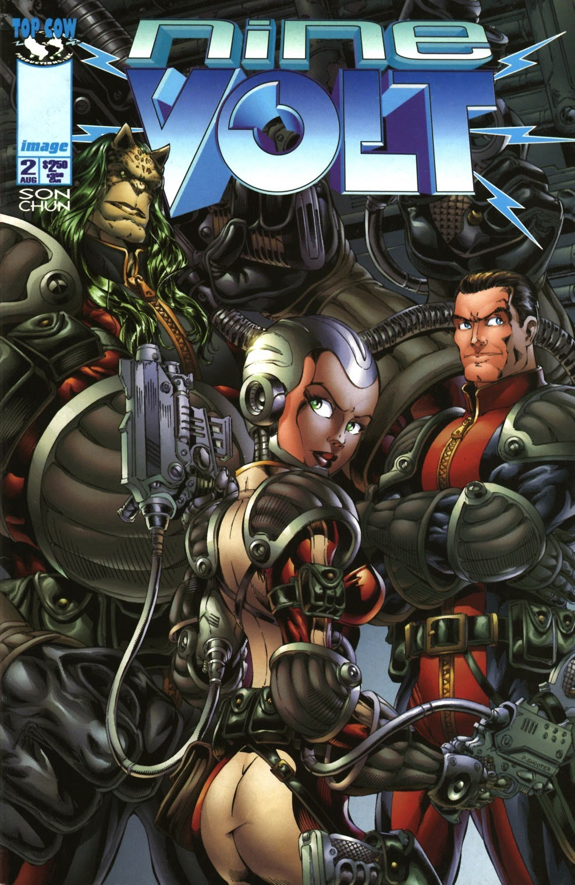
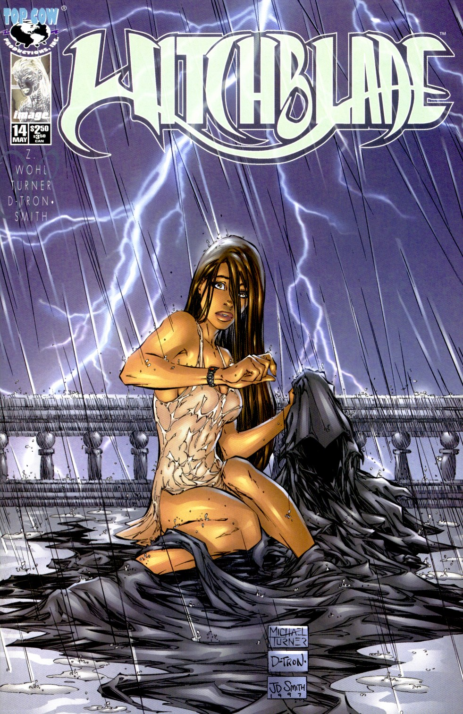
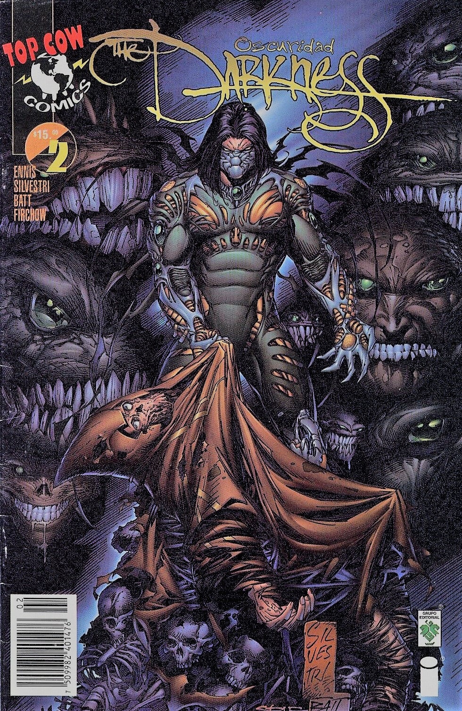
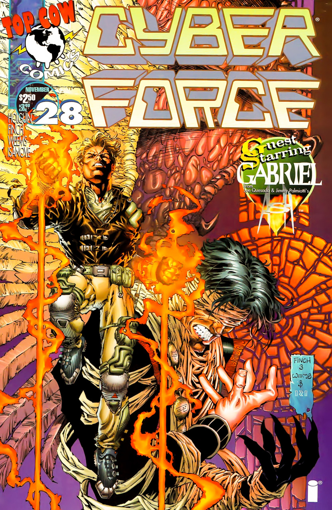
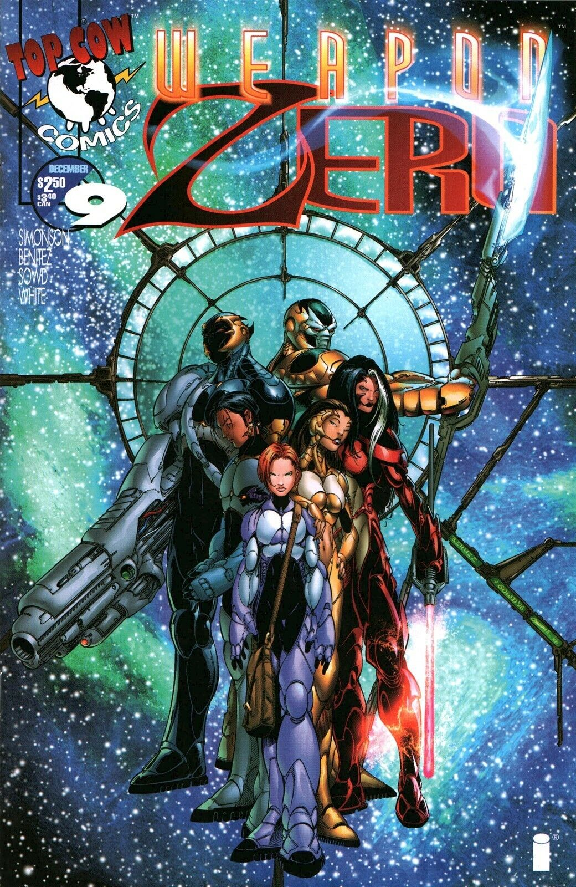
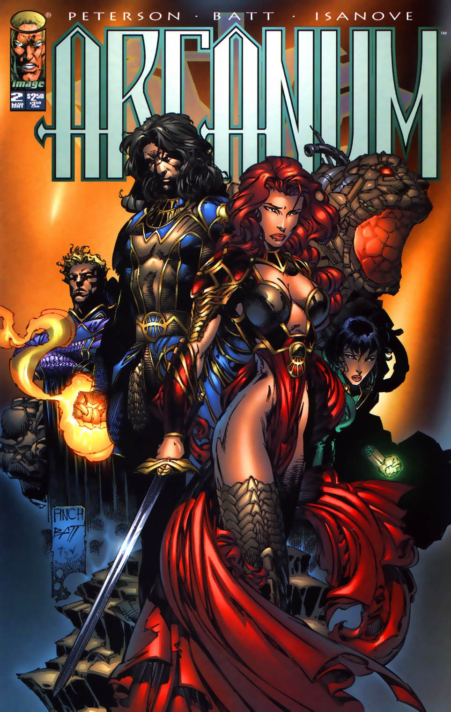

# Top Cow Comics: ¿Quién dijo que las vacas no vuelan?

**Leandro Oberto**

En Santa Monica USA, a escasas cuadras del mar se encuentra Top Cow Productions, el estudio fundado por el dibujante de comics Marc Silvestri.

De sus entrañas han salido varios de los mas exitosos cómics norteamericanos de los últimos tiempos, destacándose entre ellos: Witchblade, Darkness y Cyber-Force.

Como toda su linea de comics desembarca este mes en Argentina gracias a no otra que Editorial Ivrea -feliz coincidencia-, nuestra alma pro-chivos-descarados considero que era oportuno hacer una nota sobre ellos. Después de todo, si veníamos leyendo entusiasmados sus cómics desde mucho antes de saber que tendríamos el honor de editarlos en castellano sera por algo.

Casi cardúmenes de personas de los aspectos más diversos cambian o patinan por la famosa peatonal Third Promenade entre restaurants, disquerías, librerías, cines y extraños negocios. Nos metemos en una pequeña galería que parece ser de oficinas, pero una de ellas es muy particular, su nombre en la puerta reza: Top Cow Productions. "Cuando llamó por primera vez a otra empresa y les menciono el nombre de la compañía inevitablemente se quedan sin palabras del otro lado!" nos comenta Tim Hernández, nuestro contacto en Top Cow, y nos invita a pasar. "La culpa la tiene Marc!" sigue "La noche que tenía que decidir el nombre que le pondría a la editorial se fue a tomar cervezas con sus compañeros de trabajo y todos terminaron medio en pedo. Marc se divertía tirando nombres ridículos... y de repente dijo: "Top Cow!". Inesperadamente todos se miraron y gritaron "eso es"...

Una vez adentro, el estudio tiene mas aspecto de bungalow de montaña que oficina de Los Ángeles. En el piso superior está toda la parte administrativa, los guionistas y la mega oficina de Marc Silvestri, a la cual Tim nos invita a subir. Ya en ella, no deja de sorprendernos la enorme pila de comics con el cartel "por leer" que tiene. Pero no es lo único llamativo: también están los infinitos y espectaculares pósters, la videocasetera y el televisor, las estatuas de personajes de Top Cow, los standups, las fotos de convenciones, pilas de papeles por todos lados, la heladera con 14 variedades de ice tea, y hasta una cama! "Para cuando se queda hasta muy tarde dibujando" dice Tim riéndose. Pero sin duda lo mejor es una escultura de una vaca abriéndose el sobretodo que lleva puesto al mas puro estilo exhibicionista, "Oh, the Top Cow" decimos.

Sub Culture, el dibujo animado que prepara Top Cow para FOX

Tim nos comenta que Silvestri se encuentra encerrado en su casa de Malibú, terminando varias páginas de ""The Darkness" que debe entregar mañana al equipo de coloreado.

"Equipo de coloreado?" decimos "Eso queremos ver!"

Top Cow es famosa por sus ultra detallados y espectaculares coloreados de comics, que son la envidia de toda la industria del cómic. "Los coloristas se han vuelto a tal nivel una parte importante del estudio que incluso hacemos aparecer sus nombres en las tapas de los cómics", comenta Tim. Esquivamos gente que corre a mandar faxes, una pila de más de 1000 cartas de lectores y varias cajas de comics, descendemos a la planta baja, donde en tres grandes salas se encuentran los dibujantes y los coloristas. Para nuestra desgracia no hay nadie verdaderamente dibujando, solo se encuentran un par de entintadores, pero esta comiendo un Big Mac uno y leyendo cómics el otro... En cambio, los coloristas parecen estar muy metidos en su trabajo. Tres maquinas contra la pared derecha, tres maquinas sobre la pared izquierda y un enorme scanner de tamaño nunca visto contra la pared del fondo.

Los coloristas parecen rendirle una especie de culto y veneración a su super scanner, "Nadie lo tiene más grande que nosotros" bromean con doble intención, mientras con el Photoshop colorean las imágenes de los dibujantes.

No podemos evitar preguntarles - "hacen eso solo con el Photoshop?" -"Si", responden tranquilamente.

> "Mierda que son buenos..." pensamos.

El ambiente de calidez del lugar sorprendería a cualquiera. Pero, después de todo, es lógico cuando una empresa esta fundada y operada por un artista y fan de los comics. Y no es uno cualquiera, es uno que al contrario de otros afirma tener la siguiente política de trabajo. "hacer dinero?" si, obviamente. Pero con algo que me guste, crea y me parezca bueno".

El estudio nació en 1992, cuando se fundó Image Comics. Pero en ese entonces, compartía una oficina en San Diego con Wildstorm, el estudio de Jim Lee. "Nos separamos porque teníamos muchos negocios en Los Ángeles y no podíamos darnos el lujo de perder todo un día manejando hasta acá" dice Tim y agrega "Con el correr de los años las políticas de las dos empresas se han ido diferenciando bastante también."

Hoy día Top Cow está conforme con lo que es. Witchblade y Darkness son dos ultra mega hits a nivel mundial. Cyberforce, Arcanum y Weapon Zero se mantienen entre los cómics mas vendidos de USA y cuentan con más de 20 ediciones extranjeras. Y no paran ahí los muchachos: Nine Volt, Ascensión y Tao son los nombres de los nuevos cómics que están preparando y en los que todo el estudio tiene apostadas sus cartas... "continuaremos diversificando nuestro estilo de publicaciones con ellos. Estamos muy entusiasmados con lo que nos esta saliendo ahora." nos comentan con brillo en los ojos.

Muchas adaptaciones de sus cómics a cine y TV están en marcha. Pero es sub-culture quien llama mas la atención, un dibujo animado cómico de corte ultra urbano que posiblemente produzca FOX.

Mirando los créditos vemos que es una creación de Nathan Cabrera, que no es otro que uno de los coloristas...

### El nuevo titulo de Top Cow

#### NINE VOLT

Inspirado en la popular serie X-Files, este cómic se basa en las investigaciones de la actividad paranormal y extraterrestre de un grupo de personas del gobierno norteamericano.

Personas particulares eso si: un humano, un alien llamado Ragnor y una robot llamada Digit!.

Por Cliff Son y Anthony Chun.

## LOS COMICS DE TOP COW

### WITCHBLADE

El gran mega éxito de Top Cow. Una compleja historia urbana/policial con un trasfondo fantástico/mitológico, Sara Pezzini, una policía neoyorquina, es elegida por el Witchblade (un guante vivo de aspecto cibernético, origen remoto y misterioso con poderes sobrenaturales) para ser su portadora. La historia inquietante y continua que va sorprendiendo al lector numero a numero junto a los espectaculares dibujos de Michael Turner han hecho de este comic el gran favorito del 97.

### THE DARKNESS

Una serie de corte fantástico, ambientada en las familias mafiosas de New York. The Darkness es un poder que contrarrestaría al Witchblade y que es transmitido en el momento de la concepción de padres a hijos -muriendo el padre en ese momento...- Jackie Estacado es el poseedor actual del poder, y debe debatirse entre como seguir su vida de sobrino de capo mafia, como evitar que los ángeles lo maten, u otras organizaciones lo dominen, y... como tener sexo sin morir por alguna "fallita". Humor negro y aventura fantástica en la obra de Garth Ennis y Marc Silvestri.

### CYBER-FORCE

Creada por Marc Silvestri, el comic inaugural de Top Cow trata sobre un grupo de asesinos cibernéticos de una corporación de origen misterioso, que son liberados del control mental que ejercían sobre ellos, y ahora claman venganza. El problema es que Cyberdata es mucho mas de lo que todo ser humano puede llegar a imaginarse.

### WEAPON ZERO

Una impactante historia de ciencia ficción, en la que se nos cuenta una nueva versión de porque extinguieron los dinosaurios, y que vieron verdaderamente los primeros hombres que pisaron la luna. Acción e intriga de la mano del veterano escritor de ciencia ficción Walter Simonson y Joe Benitez (influido por la animación japonesa).

### ARCANUM

Una curiosa aventura acerca de la destrucción del mundo, magos, venganzas milenarias, mundos paralelos y el ciberespacio de internet! Brandon Peterson escribe y dibuja esta particular historia que pretende revolucionar el género medieval fantástico.

_En el pasado Top Cow ha publicado las siguientes miniseries: Ballistic, Medieval Spawn/Witchblade, Ripclaw (2 mini series) Codename Stryke Force, 21 y Velocity. Además de incontables especiales._
