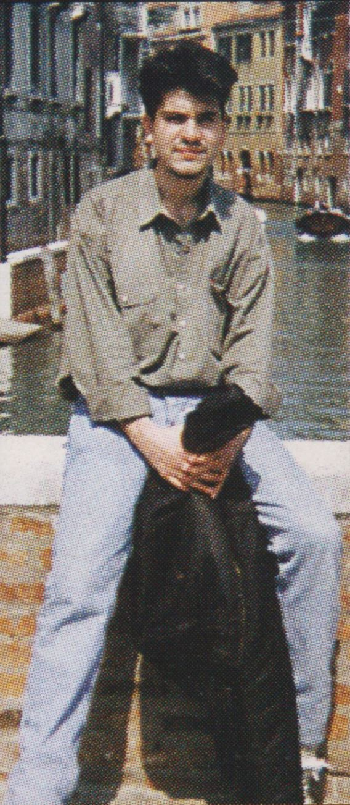

# Les gustó... y ahora que hago?

Teniendo en frente mió las cifras de venta y la cantidad de cartas por el número uno es fácil llegar a una conclusión: Lazer es un éxito.

Ahora… Debería estar saltando en una pata, no? Sí, lo estoy… pero también estoy aterrado. Recuerdan esa frase de "Cualquier boludo puede volver de un fracaso, pero sólo un genio de un éxito"? Nunca lo entendí tan bien como a la hora de hacer el número dos."Qué fue lo que hicimos tan bien?", "Como lo repetimos?" nos preguntábamos constantemente. Como no encontramos respuesta, terminé decidiendo seguir un solo concepto, el mismo utilizado al hacer el número uno: hacer una revista "que yo compraría". Osea, traté de no usar fórmulas pre-establecidas; pero solo Uds dirán si lo logramos…

Cambiando de tema: Fue abrumadora la cantidad de cartas de lectores/as que decían identificarse con mi comentario de "los que grabamos sailor Moon a la 1:30 am" a tal punto que ahora cuando debemos explicar el target de nuestra revista en una reunión comercial decimos "La revista para los que ven dibujos animados después de la medianoche"!

Gracias por estar con nosotros y será hasta la próxima! (Disculpen el retraso del número 2…)

