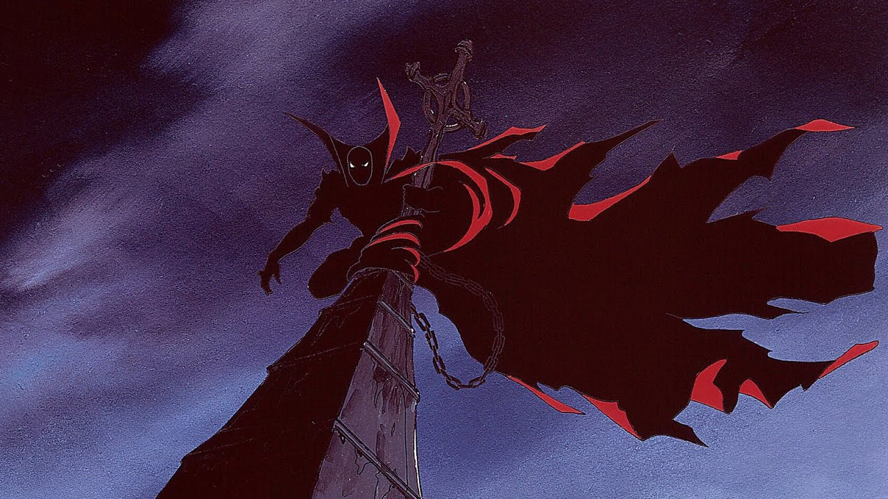

# HBO: Animandose a innovar

HBO ha decidido apostar por las series de dibujos animados para adolescentes y adultos este año, en una movida todavía poco frecuente en USA. Sus primeras producciones son: Spawn basado en el exitoso comic book de terror y fantasía de Todd Mcfarlane y Spice City de Ralph Bakshi, creador de Cool World y El gato Fritz. Ambas se espera lleguen a la versión latinoamericana del canal (HBO olé) antes de fin de año.

