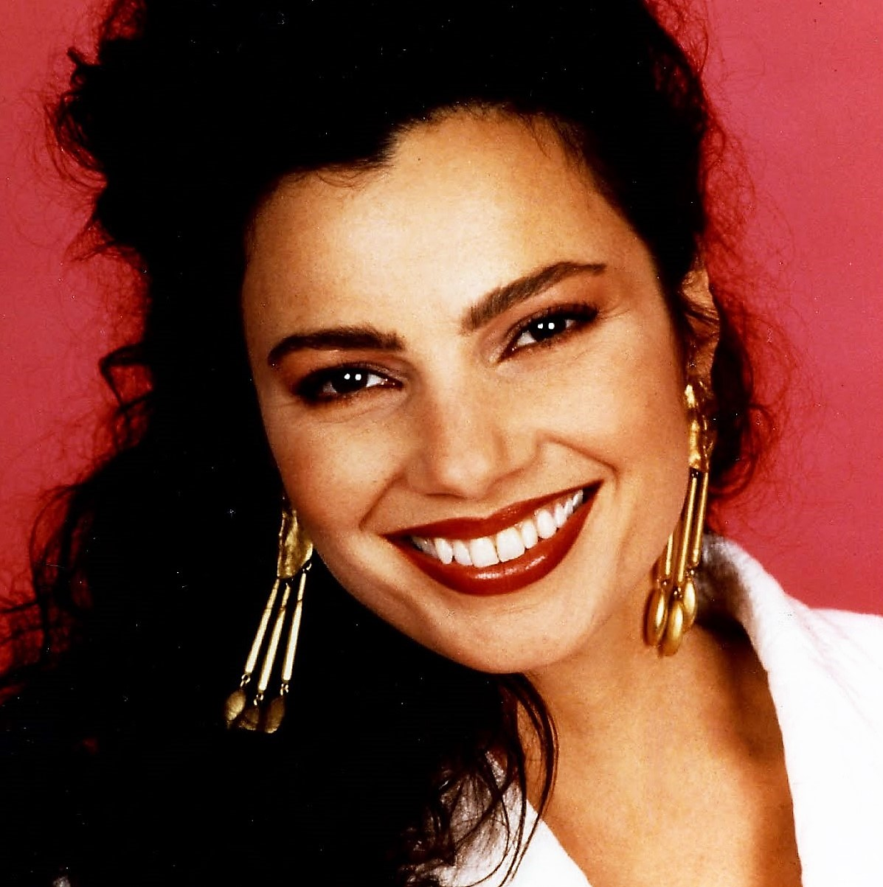

**Ada lisa Zarate y Gabriela Maya**

A partir de este número les ofreceremos una serie de diversos artículos acerca de los entretelones del doblaje. Aquí podrán conocer, entre muchas otras cosas, vida y opiniones de las voces en castellano de las series de tv y los porqués de los cambios de actores. Las entrevistas de este número fueron realizadas en México por Gabriela Maya y Adalisa Zárate, dos colegas nuestras que realizan interesantes cómics propios y revistas de información para el mercado mexicano. **_\-Leandro Oberto_**.

#### Mónica Manjarrez

Reí Hino/Sailor Mars, The nanny

**Primero cuéntanos, ¿Quien es Monica Manjarréz?**

The Nanny

Una humilde amiga que tienen ustedes que se dedica, desde pequeña, a la actuación. Empecé en teatro infantil, a los 5 años, después estuve haciendo mucha televisión, y finalmente ahora me he dedicado (bueno… tengo 12 años ya de dedicarme…) al doblaje de voz.

**Y dinos ¿Cuáles fueron tus inicios? ¿Qué fue lo que te llamó la atención para dedicarte al doblaje?**

Fue muy curioso, porque ya unas amistades que pertenecen al doblaje, Rocío Garcel y su esposo, Jorge Roy, me habían invitado a colaborar en alguna serie, pero yo no había hecho esto, porque quena incursionar en el cine. Y fue muy curioso porque un buen día a mi mamá, que también se dedica al ambiente artístico, la mandaron a trabajara doblaje, y yo empecé a ir, a ver, a conocer, primero a Sonomex, donde fueron mis inicios en doblaje, con Maynardo Zavala y Carlos Magaña, que fueron los dos directores que me tuvieron fe, porque desde un principio me dieron estelares.

**¿Recuerdas cuál fue tu primer estelar?**

Fue en una caricatura, japonesa por cierto, pero no recuerdo el nombre. Tengo muy mala memoria. Era tipo Sailor Moon pero me acuerdo. Después con Carlos Magaña hice un largometraje.

**¿Y tus inicios en la actuación?**

Fue una obra infantil "El mago de Oz", después "La Caperucita Roja", "La Cenicienta", "Blanca Nieves", fueron una serie de obras infantiles en la Compañía de Teatro de Ramón Sevilla, estuve unos cuatro o cinco años en teatro infantil. El público infantil es el más difícil, el más exigente, si a los niños no les gusta, lo dicen. Después en Televisión hicimos una serie educativa conducida por Pepita Gómez llamada "Caminito", en la que movía yo a unos monitos tipo Muppets, yo era una florecita que se llamaba Petalitos. Igual hicimos una serie que se llamaba "Juan Sin Miedo", y luego "Los Cuentos de las Mil y Una Noches", "Los Cuentos del General"… Una novela que hice que se llamo "Lobos de la tierra", y con un gran elenco Joaquín Cordero, Miguel Ángel Ferriz, varias personalidades.

**Entonces realmente has trabajado en todo el ambiente artístico…**

En cine fue menos, y en radio…

**¿Qué hiciste en la radio?**

RadioNovelas, en grupo Radiopolis. Hacíamos "Sendero de Cipreses". Algunas con Alma Muriel, con Claudio Brook.

Actualmente te localizamos en tres series de televisión: Sailor Moon como Rei/Sailor Mars, La Niñera, como la Nana Fine, y en Entertainment Tonight, como Mary Hart. ¿Cómo es doblar Entertainment Tonight, que es doblaje simultáneo?

Bueno, no es exactamente doblaje, sino Voice-Over. Es muy bonito, a mi me gusta. Una experiencia diferente, desde el año pasado, en Abril, donde hago El Hard Copy, y b hemos doblado a diario. No es sincronizado, sólo es Voice-Over.

**Entonces no deben fijarse en las labiales…**

Si hay que cuidar un poco, porque el Voice Over es tratar de empezar un poco después de que inicie el original, y terminar un poquito después, porque si no, se pasa al diálogo de otra persona, y no se entiende el sentido. Induso darles la entonación debida. En ET hago a Mary Hart, pero en Hard Copy hago a las reporteras, Jody Baskerville y Diane Diamond, y a todas las invitadas que salgan. Entonces si sale una señora mayor, darle el tono adecuado, y si sale una voz de niña, pues darle una voz más infantil.

**Pasando a Sailor Moon ¿Cómo terminaste tu con el papel de Sailor Mars?**

Eso también fue una experiencia muy bonita. La Sra. Gloria Rocha, la directora de doblaje de la primera tanda de capítulos, me hizo el favor de invitarme a colaborar para doblar a este personaje, Sailor Mars. Como ustedes ya saben, Paty Acevedo hace a Sailor Moon, Rossy Aguirre hace a Sailor Mercury, Maña Fernanda Morales hace a Sailor Venus y Araceli de León hace a Sailor Júpiter. Me invitó, yo no pensé… la verdad, el Inglés lo entiendo, pero el Japonés, para nada, y es muy difícil doblado así, porque el oír el idioma original es la guía para darse una idea de donde van para poderíos doblar, y saber que ritmo darle al personaje, pero aquí era muy difíal doblarlo. Ella me invitó a colaborar, hicimos muchos capítulos, tengo entendido que ha gustado mucho, y estoy muy orgullosa. Creo que para el actor, sea en la rama que b pongas, es muy satisfactorio la aprobación del público.

**También tienes un estelar, en el que haces a una mujer muy de los '90, que es la Nana Fine. ¿Qué es trabajar con Fran Drescher, qué es una mujer muy especial, con un tono muy especial?**

Así es.

Normalmente se hacen varias pruebas de voz, para que el diente elija, pero en este caso yo no hice prueba de voz, sino que me eligieron. Así que yo no sabía de qué se trataba. Vi que era una comedia, pero no sabía a que grado, ni la forma de hablar de ella. Al principio, como no hacían hincapié a por qué hablaba así, pensamos que estaba enferma. No fue nada fácil, pero la disfruto mucho, y me he identificado mucho con el personaje. Ella es muy agradable, muy amena. La serie tiene su mensaje, porque a pesar de todo, que pone de cabeza la casa, ha puesto todo en orden. Es una serie que disfruto mucho, está muy cuidada, es una comedia muy fina, porque a pesar de que dicen cosas picantes, las dicen bien.

**Si, es algo que hemos notado, es que en La Niñera, utilizan palabras que normalmente no se escuchan en doblaje, para una violación o una relación sexual, son utilizadas. Ella no tiene censura para hablar ¿Eso no causó ningún problema?**

El público la ha aceptado muy bien, y la ponen en un horario para toda la familia. Se ha aceptado, sin que digan que es una serie demasiado fuerte. También eso me causa mucha satisfacción, porque es un trabajo de equipo.  
Tanto la directora, Rocío Prado, como todos mis compañeros, también tengo aquí la suerte de colaborar con Rossy Aguirre, que hace a Maggie, el mayordomo, que es una belleza, Niles, que lo hace Alejandro Billy, Rafael Urera, que hace al Sr. Sheffield y todos mis compañeros, que ahora no quiero omitir a ninguno, que aunque la serie sea muy difícil, Fran Drescher es muy difícil de doblar, pues todo el tiempo esta haciendo gestos, muecas, reacciones… En dos capítulos terminó más cansada que si hubiera hecho un largometraje de dos horas. Ella me agota. Pero me satisface mucho.

Sailor Mars

**De todos los personajes que has doblado ¿Cuál es tu favorita?**

¿Sin lugar a dudas? La Nana Fine.

**¿Qué opinas del doblaje actual en México?**

Hemos estado limitados en cuanto al lenguaje. Los programas que doblamos, no los pasan solamente en México, y muchas veces lo que tú dices, en otro país tiene otro significado. Entonces tenemos que estar cuidando estas palabras, para que no se sientan o se escuchen tan fuertes. Eso nos limita un poco.

**¿El doblaje ha mejorado o empeorado, ahora que las compañías están tratando de tener todo al vapor?**

Bueno, sin lugar a dudas, el doblaje mexicano es el mejor del mundo, y está reconocido, pero la época esos grandes actores, gente valiosa, excelentes dobladores, se ha perdido. Hay gente todavía muy valiosa, pero yo quisiera que se cuidara más. Hay mucha gente joven que se interesa por este trabajo, y se han abierto escuelas. Yo creo que así alcanzaríamos otra vez el nivel que tuvimos antes.

**Nos faltan dos preguntas sobre los personajes que haces actualmente. ¿Cuál es tu opinión sobre la Nana Fine como persona?**

Bueno, ella es una chica de los '90, pero es una chica, en realidad, sin maldad, sin malicia. Todas las cosas que ella hace son porque ella es espontánea, no tiene dobleces, no es estudiada, aunque quiere parecer sofisticada, en realidad, es una chica ingenua hasta cierto punto porque se desvive por los niños, tiene su lado muy noble con el mayordomo. Está enamorada del Sr. Sheffield, ella quisiera formar parte de la familia, no como la niñera, sino como la mamá, creo que es un personaje blanco, muy noble, y que le da bonitos mensajes al público.

**En contraste con tu personaje de Sailor Moon, la voluntariosa Sailor Mars… ¿Qué opinas tu de ella, y de la serie de Sailor Moon?**

Bueno, Sailor Mars, como tu lo haz dicho, es una chica un poco caprichosa, rebelde. No es tan dócil como las demás, ha adquirido su propia personalidad. Me gusta de ella que es noble, y dinámica. La disfruto mucho porque también tiene su mensaje, cada una de las Sailors tiene su mensaje. Es una chica noble, que colabora mucho con sus compañeras. Me agrada mucho el personaje, y también me da gusto que lo acepten tanto.

**Ya para terminar, nos gustaría que nos contaras tu mejor anécdota en el doblaje.**

(Ríe) Bueno, normalmente pasa que cuando llegamos a doblar, no hemos leído el libreto. Hay veces en que no sabes ni qué personaje vas a hacer, ni de qué se trata la historia. Pues esa vez, estaba yo con Maynardo Zavala, estábamos doblando una caricatura, yo me llamaba Jota Bella, y por leer rápido, porque es de una leída y a sincronizar, en lugar de decir "Démonos Prisa", yo digo "¡Demonios Prisa!" (Ríe) ¿ Y me creerían que se hizo famosa la frase? Yo no me di cuenta al principio, y se quedó, y todos se reían… Y como esta te podría contar muchas, esta es la casa del jabonero, el que no cae, resbala… Una compañera, le pregunta a Maynardo "Esto ¿Como quieres que lo pronuncie? ¿Hubsen? ¿Hyubsen?" y lo lee Maynardo y le dice "Dice "Hubiesen" (Risas).

**¿Un último mensaje que quieras dar a los que quieren incursionar en el doblaje?**

Pues yo los invito, y si me toca conocer a alguien, que me pida ayuda, con mucho gusto lo haría. Se necesitan nuevos valores, gente con talento y con disposición para este trabajo. El que les digan que cualquiera lo puede hacer, es mentira. Muchos actores de renombre no pueden doblar. Es un trabajo muy completo, hay que poner todo. Los invito, no es fácil, no está bien pagado, pero el que persevera alcanza, y por ejemplo, yo no dejaría el doblaje. Tal vez no trabajaría de las 10 de la mañana alas 10 de la noche, pero nunca lo dejaría por completo. Es un trabajo muy noble, y yo sería muy malagradecida si no dijera que en estos doce años no he aprendido mucho.

#### **Rosi Aguirre**

Krylin, Sailor Mercury, Gossalyn

**¿Cuando empezaste tu carrera?**

La inicié a los cinco años, empecé con 11 películas de Shirley Temple. Y, fue por casualidad, mi mamá, Rosanelda Aguirre (Directora de Doblaje de Viajeros en el Tiempo), me llevaba a su trabajo, y de pronto le dicen "Una prueba para la niña", y mi mamá "¿Como creen? Está muy chiquita?" "Si, si vamos a hacer una prueba, a ver que tal", Y me quedo en la prueba, con mi mamá muerta del nervio, y la verdad es que me gustó hacerlo. Ha sido el amor de mi vida.

**De tus trabajos, ¿Cuales han sido las series o personajes que te han gustado más?**

Sailor Mercury

Es muy difícil decirlo, por que igual, te encariñas con todos. ¿ Te imaginas en 23 años la cantidad que he doblado?. De caricaturas no te podría decir muchas, me acuerdo de una de un niño que se convertía en automóvil, pero no me acuerdo del nombre. Actuadas, "La Ultima Frontera", en "Me!rose Place", en "Ready or Not", que es como "Los Años Maravillosos/Kevin: the wonder years", donde hago a Buzzy, en "Directo al Sur", pero es un papel muy pequeñito.

Muchos largometrajes, como "Poltergeist", donde hago a la hermana mas grande, "Mejorando la casa", hago a Brad, el niño mas grande, esta me encanta. También en "Chucky, el Muñeco Diabólico", hago al niño. Ahí una serie que se llama "La Vida de Angela", que pasa en Multivision. Ahí hago a Angela, que haz de cuenta, soy yo. Me encanta el personaje.

**¿Qué sientes cuando escuchas tu trabajo terminado?**

Obviamente te la pasas criticándote, sientes que deberías haber dado otro tono. Es bueno, porque sabes cómo debes mejorar tu trabajo.

**¿Qué carrera estudiaste para tu trabajo?**

Tome la carrera de actuación, pero no la terminé por varias razones. Pero, yo creo que esto te da muchas tablas, y más cuando empiezas desde chiquita. Soy mas autodidacta, y mi mamá, que es mi principal maestra.

**De las series que estas haciendo ahorita, que son Dragón Ball y Sailor Moon, ¿Qué opinas de tus personajes, tan opuestos entre sí?**

A mi Krilin me fascina, porque es muy simpático, es noble, muy, muy noble. Sabe reconocer sus errores, pero de pronto no quiere, es medio rebeldón, pero si dice "No, pues si la estoy regando por acá". Siempre está tratando de mejorar, es lo que me gusta, y a pesar de que Goku vendría siendo su competencia, le da ánimo a su amigo, la cuestión de la amistad es mas importante que cualquier lucha. De Sailor Mercury, me gusto que es una niña muy centrada, es la que se pone entre Sailor Moon y las otras. Es la que sabe qué busca y por qué lo busca.

Es la conciliadora de las Sailors. Me agrada su forma de actuar, por que piensa las cosas antes de hacerlas. Sabe cómo ubicar a las otras.

Krilin

**En Dragón Ball, ¿Cual es el episodio que más recuerdas o que más trabajo te costo doblar?**

Creo que todos cuestan trabajo, por que es difícil doblar del japonés al español. Es difícil porque no entiendes nada de lo que dice el japonés (Ríe). Ensayas un loop y dices "Ya quedó", pero lo grabas y quedas corta, se repite, y la misma frase es muy larga. Es difícil porque la guía en Japonés no te ayuda mucho. Una serie en Inglés es más fácil, y como que le talachas más, pero el Japonés…

**Aparte de estas dos ¿Haz llegado a trabajar en otras series japonesas?**

Había una, como de Fútbol, parecida a SuperCampeones, pero con monstruitos, había algo de un Dragón… No ha salido en la tele, y la doblamos hace 4o 5 años. Yo era la princesa. No me acuerdo del nombre.

**Y de Disney ¿Solo haz trabajado en Darkwing y PatoAventuras (Ducktales)?**

En PatoAventuras, doble tres años a uno de los sobrinos, Paco, pero ahorita ya lo hace otra persona. Si he trabajado mucho, pero algo importante…. Por ejemplo, ahorita cuando la pasen doblada, en Jóvenes Brujas yo hice a la negrita…

**¿Qué te pareció trabajar en esa película?**

Está padrísima, tiene unos efectos…No la vi toda, pero te pica en la trama. Tiene mensaje la película.

**¿Cuál sería el mensaje?**

El mensaje sería que no juegues con cosas que no sabes lo que son, y que es muy peligroso jugar contra el orden del Universo. Porque se te puede revertir.

**¿Qué opinas tú del trabajo de doblaje en las películas? ¿Crees que se afecta el trabajo original?**

Tal vez si afecta, en el sentido de que se pierden ciertas cosas. El chiste del doblaje es no perder la idea de la trama, pero a veces se tienen que perder ciertas ideas, por cuestiones de la censura, a veces tienes que cambiar ciertas cosas. El doblaje es importante porque muchas veces uno no sabe otro idioma. Puedes ir al cine y ver la película con letreros, y por estar leyendo, pierdes muchas cosas que son importantes en imagen. Con el doblaje no pierdes el mensaje visual. En este país hay mucha gente analfabeta, y un entretenimiento en su idioma, ayuda mucho.

**Regresando a Dragón Ball y Sailor Moon, ¿Cuales son los capítulos que más recuerdas?**

Cuando Goku y Krilin pelean. Ese me gusto mucho, por la cuestión de la amistad. "Vamos adelante los dos, como amigos. " De Sailor Moon…. La verdad no recuerdo mucho.

**Y hablando de ti ¿Qué es lo que más te gusta hacer?**

Me gusta leer, me gusta pintar cerámica, me encanta oír música, rock, New Age, de todo, depende de mi estado de ánimo.

**¿Alguna anécdota que te haya pasado doblando, que quieras compartir con nosotros?**

Uy. Una vez que estábamos doblando Karate Kid 3, yo hacia a la chava (Ríe). Había una escena en la que estaban buscando el bonsai, subiendo una montaña. Era una escena de reacciones, de respiraciones, de mucho esfuerzo. Y de pronto se me empezó a bajar la presión, y seguimos (Respira fuertemente), y que me desmayo, a la mitad del loop. Mi mamá estaba dirigiendo, y casi le da el infarto. Lo más chistoso fue como me caí, estaba en un banco alto, y caí como regla, perdida (Ríe). Es que en los cuartos donde trabajamos está cerrado, no hay buena ventilación.

**Fuera del doblaje, ¿Cuáles han sido tus trabajos?**

Hice un programa de televisión que se llamó SuperOndas, yo era Bibby Bitty Boppy. Era para niños, con la misma productora que Burbujas. Hice 2 capítulos en La Telaraña. De teatro no he hecho comercial, sino experimental. En Radio, una radionovela que se llamaba "La Casona de la Hiena", en la XEW, yo hacía a Tatiana, que era la nieta del protagonista.

**¿Cuáles son tus planes para el futuro?**

Pues seguirme preparando, seguir estudiando. Perfeccionar el Inglés, tal vez estudiar Francés, seguir preparándome. Tomar algún taller.

**Directamente en el doblaje ¿El Doblaje Mexicano a mejorado, a empeorado?**

Yo siento que sí ha perdido mucho, antes se respetaba más el doblaje. Ahora llega gente que no entiende la importancia de ser actor en esto, y creen que nada más por tener bonita voz, ya la hicieron. Entonces, por favoritismos, sindicatos, por muchas cosas se pierde ese amor al doblaje. No es sólo llegar y leer. Es importante actuar. Tienes que vivirlo. Tratar de mejorar, o igualar el trabajo original. Hay gente que no le tiene suficiente amor a esto.

#### Gloría Rocha

Directora de doblaje de Sailor Moon (Caps 1 a 65),Dragón Ball y Dragon Ball Z

**¿Cuando inicio su carrera de doblaje, y cuando comenzó como directora?**

Bueno, yo entre en 1960 al doblaje, vengo de radio, trabaje en XEQ, en XEW… uy Dió!… es un carruaje!…. (Leandro)

**¿Era locutora?**

No, Actriz de Radio-novelas

**¿Y en qué series comenzó a trabajar?**

Uy, muchísimas. La primera que recuerdo, que fue con la que empezamos, fue El Submarino, con Lloyd Bridges, también en Alfred Hitchcok, en El Gran Chaparral, después vino la serie con Dean Casey, El túnel del Tiempo, yo era la doctora.

**¿Cómo empezó en dirección?**

En Dirección, yo empecé en 1974, con una serie inglesa, que era El Príncipe y el Mendigo. Antes, yo trabajaba mucho con Pepe Lavat, por los comerciales y demás, yo me quedaba dirigiendo sus películas, y al él daban las mejores, entonces me foguee. Hice también una . serie muy bonita, que se llamó Oppenheimer, inglesa, Los de Arriba y los de Abajo, y muchas series brasileñas… Primero dirigió el licenciado Ortigosa una serie bellísima, que se llamaba el Bienamado, después vinieron otras series, porque ese fue el piloto. Trabajé al lado de Claudio Brooks, Sergio Bustamante, Narciso Busquets, Polo Ortin, Yolanda Mérida, Rita Lavat, Jorge Lavat…

**¿Cómo era el doblaje en aquel entonces?**

En aquél entonces era en 16 milímetros, y de ahí nació la palabra loop. Porque era un tramo de película con pinchaduras, para prepararse. Pasaba, se ensayaba, se repetía. Era todo el tramo, no solo el pedacito, como ahora. Y había distancias, se proyectaba más la voz. Y en aquél entonces se utilizaba más radiofónica la voz, porque uno daba los volúmenes de voz.

**De toda su carrera, ¿Qué papeles recuerda con mas cariño?**

Recuerdo varias. Doris, de los de Arriba y los de Abajo. Son Muchas, en el Bienamado tenia un papel muy bonito. En esa misma época, al lado de Jorge Arbizu, que es un genio para las caricaturas, yo era parte de su grupo para las caricaturas. Ya no me acuerdo de los nombres.

**¿Tiene alguna anécdota de esa época?**

Pues que el ,al script lo tiraba, entonces era el inventar con pantalla. Todos cooperábamos. Y asi, con películas de media hora, terminábamos a las diez horas.

Por eso sonaban tan sueltas, tan diferentes…

Ahora, hay muchos talentos. Lo que pasa es que nos llega un doblaje muy malo de los Angeles, con voces espantosas, y dicen el doblaje… Pues hay mucho doblaje feo, que no es nuestro, Argentina, Santiago de Chile, Venezuela, de España… Y ahí muchas series buenas, de España.

**¿En qué series esta trabajando actualmente como directora?**

Ahorita, en Dragón Ball, en una que se llama 74.5, la nueva onda, que es brasileña.

**Entonces nos siguen llegando series de todo el mundo a ser dobladas.**

Si, antes nos llegaban muchas de Italia y Francia, pero ya no.

**¿A qué cree que se deba esto?**

Pues, no sé. Se habrán ido a Venezuela, porque ahí no cobran. Hacen el doblaje, y ellos explotan el producto.

**Ahora está trabajando en dos de las series japonesas más famosas: Dragón Ball y Sailor Moon. En Dragón Ball, no se han respetado a los personajes, sino que han hecho algunos cambios. ¿Cuales son estos cambios?**

Muchos. En primer lugar, yo siento respeto por todas las casas, especialmente a los niños. Entonces, yo quito la palabra muerte, maldito. Y algo de cambio de imagen, pues que el maestro Roshi es un viejo verde, y para justificar la imagen, nos referimos a otra cosa.

Hija de una una gran puta!!! Retrógrada!!! Menos mal que no hice yo la entrevista porque sino los de Intertrack se quedaban sin su vaca sagrada. **\- Leandro**

Nota: de los cortes de imagen fue responsable el canal mexicano.

**También Oolong recibió cierta "Censura", pero como usted nos dice, "es por los niños"….**

Es que Dragón Ball no la considero para niños. Tiene cositas muy… A lo mejor a nosotros no nos gustan. A lo mejor es para que un viejo rabo verde no se acerque a la niña, o para que la niña se defienda, como Lunch o Bulma… (Risas)

**Y pasando a la otra serie, ¿Qué le pareció dirigir Sailor Moon, qué es una serie con puras niñas?**

Muy bonita, muy infantil, con sueños de ser grande. Doblamos 65 capítulos, el año pasado.

**De Sailor Moon, queríamos preguntarle, ¿Recuerda usted al personaje Zoycite?**

Si, como no.

**Bueno, Zoycite, en Japón, es un personaje masculino, aunque es gay. Aquí en México tiene una voz de mujer, quisiéramos preguntarle por qué.**

Yo en eso tuve una gran duda, si era hombre o mujer. Lo hicimos mujer, porque vimos la relación que tenia con Malachite, que se amaban. Le vimos cara de mujer, y desgraciadamente no nos mandan una relación de personajes.

**Entonces no tiene nada que ver con censura…**

No, aquí fue una equivocación. (Risas)

**¿Cómo siente estas dos series japonesas?**

La primera, como ya traía el lip sync en español, no tuvimos problema, pero con Sailor Moon, como nos llegó en japonés, nos dió mucho trabajo.

**¿Cómo hace usted el casting, para elegir a sus actores?**

Veo la película, y voy eligiendo a los actores… A veces tengo mis equivocaciones. (Risas)

**¿Usted ha visto la serie, ya terminada?**

Si (Risas). En varios restaurantes, he visto a mamás pidiendo que le pongan a sus niños canal 5, para que vean Dragón Ball… (Risas). Me sorprendió ver que no cortaran imágenes, en muchos capítulos.

**¿Qué opina de la Animación Japonesa en general?**

Es muy buena, nada mas que muy bélica. Algunas eran muy bonitas, como Heidi.

**Una última pregunta, muchos actores se refieren a usted como la Madrina ¿A qué se debe?**

Un compañero, Rodolfo Vargas, trabaja mucho, en todas las compañías, hasta en los Angeles. Cuando venía, yo siempre lo adopte, sin rencores, aunque a veces me dejaba el trabajo, y el fue el que me puso Madrina. Y así se fue heredando.

#### Paty Acevedo

Serena Tsukino/Sailor Moon - Lisa simpson - Directora de doblaje de Sailor Moon (caps 66 a 127)

Nota: La entrevista fue realizada medio a la carrera arriba del auto de Paty a la salida del trabajo.

Sailor Moon

**¿Cuáles fueron tus inicios en doblaje?**

Mis inicios fueron hace 18 años, empece con una serie que se llamaba "Gasparín y los Super Angeles", de ahí, Viajeros, Vecinos y Amigos… muchos

**¿Cuál fue la primera serie que dirigiste?**

Caroline en la ciudad. Me lo dio la Sra. Gloria Rocha

**¿Cuáles han sido tus experiencias como directora?**

Es mucha responsabilidad, es muy difícil dirigir. Hablar bien el español, corregir a todos, que quede exacto. Es muy difícil.

**¿De todos los papeles que has hecho, cuál ha sido tu favorito?**

Beca, de "La vida sigue su curso"

**¿Qué prefieres doblar, Animación o Actores?**

Actores.

**De Sailor Moon, que es la serie que estás dirigiendo ahora, ¿Cuál es tu opinión de Serena como persona?**

Es una niña muy tonta. En vez de hacer muchas cosas, se la pasa llorando y gritando, y haciendo cosas tontas, a pesar de ser la heroína.

**En Dragón Ball, haces a Chaoz y a Milk ¿Cómo te cae Chaoz?**

Bien. Lo que pasa es que Chaoz es un personaje que no tiene mucho de donde sacarle, es un personaje sin ningún chiste. Se la pasa haciendo reacciones, casi no habla.

**En definitiva, a ti te gusta más hacer actores vivos. ¿Aparte de Sailor Moon y Dragón Ball, en qué otras series estás trabajando ahorita?**

En los Simpsons. Los Simpsons es la serie que más me ha dado a conocer con la gente. Gracias la los Simpson nos han hecho entrevistas para revistas, radio, televisión. Lisa es el personaje que más satisfacción me ha dado. También hago a Charlene en los Dinosaurios, a Joy y Margaret en Daniel el Travieso, a Brian en Mejorando la casa, a Dinah y a Brenda en Mejorando la casa. A la niña de Mis Dos Papás. Varios…

**En estos dias, en el horario que sea, en el canal que sea, te escuchamos…**

(Ríe) Afortunadamente tengo mucho trabajo.

**¿Cuál es tu opinión de Lisa Simpson?**

Lisa es una niña muy inteligente, que quiere mucho a su familia, y lucha por sacarlos adelante de alguna manera, aunque sea a su forma, y algunas veces lo logra y a veces no.

Lisa Simpson

**¿Qué es lo que estudiaste para la carrera de Doblaje?**

Tome un curso en Oruga, y lo que aprendí en salas. Afortunadamente cuando yo empecé había gente muy buena haciendo doblaje, y viéndolos a ellos, aprendí sobre la práctica.

**¿Además de doblaje, a qué más te dedicas?**

Nada más.

**¿Cuáles son tus proyectos a futuro?**

Pues, seguir en esto. En este trabajo uno nunca puede decir que es estrella. Todos los días se aprende algo nuevo. Hay loops dificilísimos, que aunque uno tenga mucha experiencia a veces, con uno se atora, y esta dale y dale. Quiero llegar a dirigir muy bien.

Además de Sailor Moon, ¿Estás dirigiendo alguna otra serie?

Los conquistadores, que es francesa. Hago a Gloria, una niña de la edad de Sailor Moon.

**Te han dado muchos papeles de niñas…**

Si, son lo que más se me da, las niñas, las adolescentes… De mujeres solamente he hecho en Friends a Rachel y en Savannah.

**¿Cómo ha sido dirigir Sailor Moon?**

Muy difícil, hay mucha gente. Coordinar a todos es muy difícil. Afortunadamente la gente se presta a trabajar conmigo, trato de sacarlos lo mas rápido que puedo, dentro de lo que permite la gente, llamarlos una vez a la semana solamente. Y la gente ha respondido bastante bien. Ha sido una experiencia grata con todo y todo. Es difícil porque cada vez sale más gente y la mayoría quiere doblar solo sus loops, pero no se puede porque solo tenemos cinco tracks y tengo que coordinar a todos (Track es un canal de grabación, nos dan cinco canales para meter a toda la gente)

**¿Cómo hiciste tu cast?**

La mayoría de la gente ya estaba elegida, los fijos principalmente. Las Sailors, las primeras. Eso lo respeté hasta donde se pudo.

NOTA: la voz de Darien/ Tuxedo Mask debió ser cambiada por problemas entre el actor y la compañía.

Y de las nuevas, bueno, de tantos años, uno ya sabe quien puede hacer los personajes. Hay personas que pueden hacer una joven, un viejito. Y ya más o menos los conocemos. Siempre es así, dependiendo de cómo veamos el actor, ya sabemos quién puede hacer qué.

**De los trabajos que has dirigido, ¿Con cuál has estado más satisfecha?.**

Con todos, y realmente, mi trabajo, ya sea como actriz o como directora, me encanta. Lo disfruto mucho. No es pesado, lo que sea lo hago con mucho gusto.

**¿Qué recomendaciones le darías a los que desean empezar en doblaje?**

Que estudien. Que se metan a alguna escuela donde enseñen doblaje, hay cursos en las empresas, hay escuelas. El Andrés Soler y esas academias de actuación creo que si tocan doblaje pero muy poco. Hay lugares donde se dedican exclusivamente al doblaje. Siempre se necesita gente nueva porque la gente va creciendo y cambia de voz. Es un trabajo muy difícil, no todos los que quieren doblar lo logran. Hay gente que tiene, no sé, treinta o más años intentando hacer doblaje, siguen reportándose pero no funcionan, son persistentes, y hay otros que en dos, tres meses que luego luego se ve que si van a funcionar.

## Sailor Moon

### **Parodias eróticas**

Por pedido unánime de los lectores continuamos com más parodias eróticas. Aquí mas dibujos hechos por fans de todo el mundo como ilustraciones de computadora o para diversos cómics. En la página de la derecha dibujos hechos por nuestros lectores/as. Nada más universal que el sexo, verdad?

    

    

