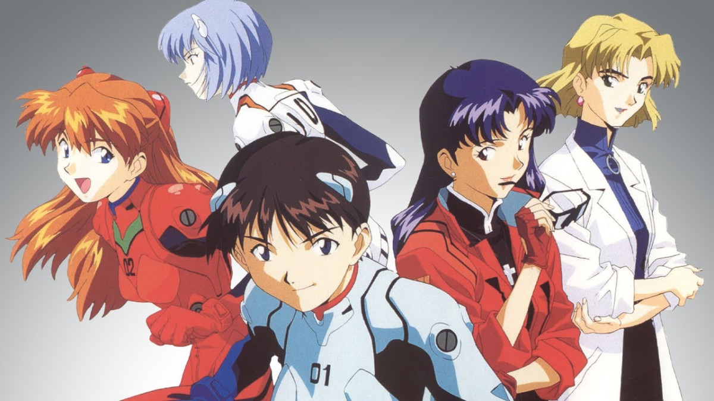

# Evangelion: Cuando la calidad resulta lo mas comercial

Acaba de finalizar en una segunda película para cine Neon Genesis Evangelion, la serie japonesa más exitosa y shockeante de la década.

Esta compleja y cuidada creación del Studio Gainax (un famoso equipo de animadores formado por fans que han realizado algunas de las series y películas más innovativas de los últimos años) ha marcado un antes y después en la televisión nipona, instaurando una nueva marca de calidad a la cual apuntar. La serie, de 26 capítulos, dirigida por Hideaki Anno es una contundente historia de ciencia ficción que mezcla la aventura, las relaciones humanas, la política y el espionaje con las preguntas sobre los porqués de la raza humana. Se inspira en novelas clásicas como "Childhood's end/El fin de la infancia" de Arthur C. Clarke. 

Mas de un millón de japoneses vieron en la semana del estreno cada una de las películas que concluyen la saga televisiva y sus videos, laserdiscs y compact discs se sitúan entre los más vendidos (animación o no) de todos los tiempos.
